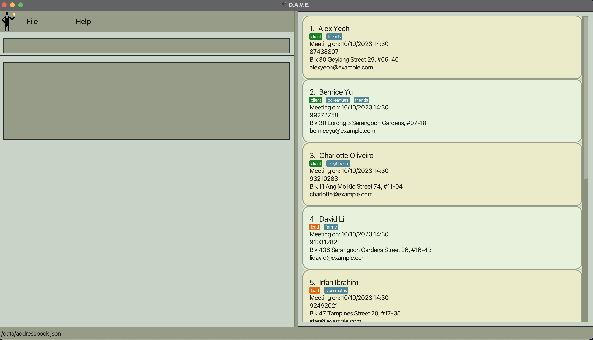

# D.A.V.E. (D’financial AdVisor Expert)

> Manage your leads and clients information effortlessly through D.A.V.E. to gain an edge in your FA journey!

## About
D.A.V.E. is a leads and clients management tool for student financial advisors specifically in NUS, but can be used for all student financial advisors.

## UI

## Getting Started
1. Ensure you have Java `11` or above installed in your computer.
2. Download the latest `DAVE.jar` from here.
3. Copy the file to the folder you want to use as the *home folder* for D.A.V.E.
4. Double-click `DAVE.jar` to start the app.

## Acknowledgements
This project is based on the AddressBook-Level3 project created by the [SE-EDU initiative](https://se-education.org).
