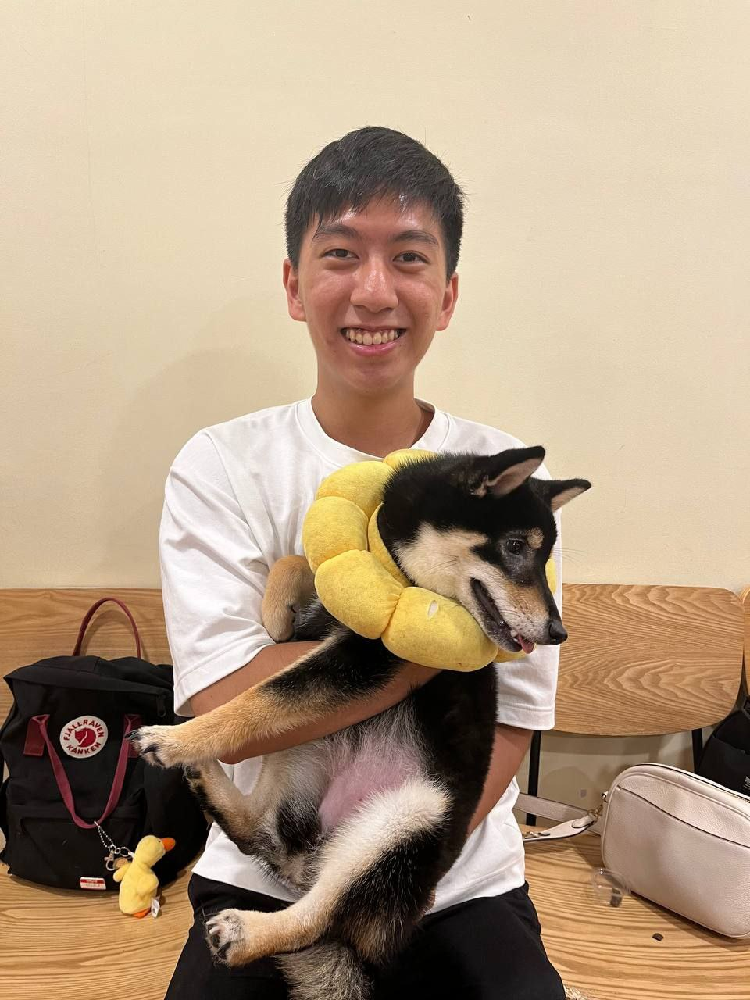
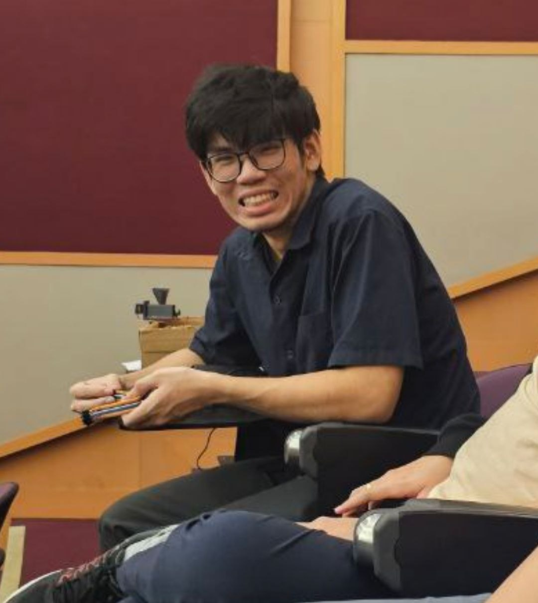
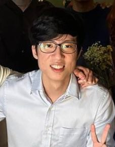
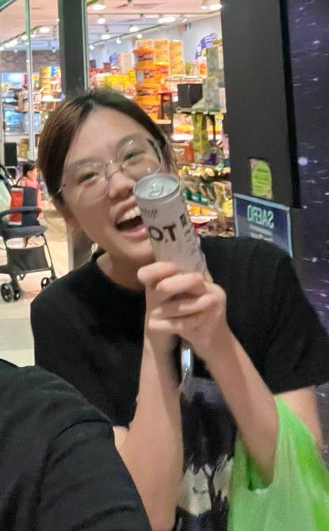
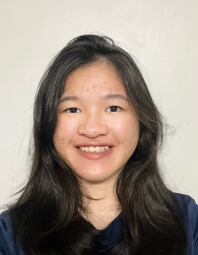

# About Us

We are a team based in the [School of Computing, National University of Singapore](http://www.comp.nus.edu.sg).

## Project team

### Gary

[[github](https://github.com/garylow2001)] 
[[portfolio](https://ay2324s1-cs2103t-f08-2.github.io/tp/team/garylow2001.html)]

* Role: Developer
* Responsibilities: Scheduling and Tracking

### Licong

[[github](https://github.com/LicongHuang)]
[[portfolio](https://ay2324s1-cs2103t-f08-2.github.io/tp/team/liconghuang.html)]

* Role: Developer
* Responsibilities: Integration

### Jie Xiang

[[github](https://github.com/jx124)]
[[portfolio](https://ay2324s1-cs2103t-f08-2.github.io/tp/team/jx124.html)]

* Role: Developer
* Responsibilities: Code Quality

### Yu Xun

[[github](https://github.com/yuxunn)]
[[portfolio](https://ay2324s1-cs2103t-f08-2.github.io/tp/team/yuxunn.html)]

* Role: Developer
* Responsibilities: Testing

### Tiffany

[[github](https://github.com/tiif)]
[[portfolio](https://ay2324s1-cs2103t-f08-2.github.io/tp/team/tiif.html)]

* Role: Developer
* Responsibilities: Deliverable and deadlines
