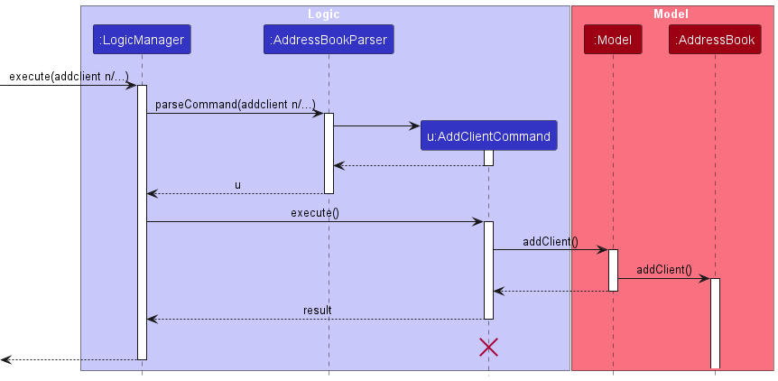
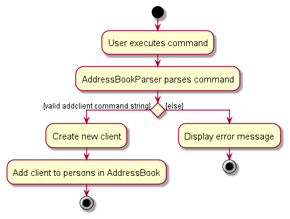

# AB-3 Developer Guide

<!-- * Table of Contents -->
<page-nav-print />

--------------------------------------------------------------------------------------------------------------------

## **Acknowledgements**

_{ list here sources of all reused/adapted ideas, code, documentation, and third-party libraries -- include links to the original source as well }_

--------------------------------------------------------------------------------------------------------------------
## **Setting up, getting started**

Refer to the guide [_Setting up and getting started_](SettingUp.md).

--------------------------------------------------------------------------------------------------------------------

## **Design**

### Architecture


The ***Architecture Diagram*** given above explains the high-level design of the App.

Given below is a quick overview of main components and how they interact with each other.

**Main components of the architecture**

**`Main`** (consisting of classes [`Main`](https://github.com/se-edu/addressbook-level3/tree/master/src/main/java/seedu/address/Main.java) and [`MainApp`](https://github.com/se-edu/addressbook-level3/tree/master/src/main/java/seedu/address/MainApp.java)) is in charge of the app launch and shut down.
* At app launch, it initializes the other components in the correct sequence, and connects them up with each other.
* At shut down, it shuts down the other components and invokes cleanup methods where necessary.

The bulk of the app's work is done by the following four components:

* [**`UI`**](#ui-component): The UI of the App.
* [**`Logic`**](#logic-component): The command executor.
* [**`Model`**](#model-component): Holds the data of the App in memory.
* [**`Storage`**](#storage-component): Reads data from, and writes data to, the hard disk.

[**`Commons`**](#common-classes) represents a collection of classes used by multiple other components.

**How the architecture components interact with each other**

The *Sequence Diagram* below shows how the components interact with each other for the scenario where the user issues the command `delete 1`.


Each of the four main components (also shown in the diagram above),

* defines its *API* in an `interface` with the same name as the Component.
* implements its functionality using a concrete `{Component Name}Manager` class (which follows the corresponding API `interface` mentioned in the previous point.

For example, the `Logic` component defines its API in the `Logic.java` interface and implements its functionality using the `LogicManager.java` class which follows the `Logic` interface. Other components interact with a given component through its interface rather than the concrete class (reason: to prevent outside component's being coupled to the implementation of a component), as illustrated in the (partial) class diagram below.


The sections below give more details of each component.

### UI component

The **API** of this component is specified in [`Ui.java`](https://github.com/se-edu/addressbook-level3/tree/master/src/main/java/seedu/address/ui/Ui.java)


The UI consists of a `MainWindow` that is made up of parts e.g.`CommandBox`, `ResultDisplay`, `PersonListPanel`, `StatusBarFooter` etc. All these, including the `MainWindow`, inherit from the abstract `UiPart` class which captures the commonalities between classes that represent parts of the visible GUI.

The `UI` component uses the JavaFx UI framework. The layout of these UI parts are defined in matching `.fxml` files that are in the `src/main/resources/view` folder. For example, the layout of the [`MainWindow`](https://github.com/se-edu/addressbook-level3/tree/master/src/main/java/seedu/address/ui/MainWindow.java) is specified in [`MainWindow.fxml`](https://github.com/se-edu/addressbook-level3/tree/master/src/main/resources/view/MainWindow.fxml)

The `UI` component,

* executes user commands using the `Logic` component.
* listens for changes to `Model` data so that the UI can be updated with the modified data.
* keeps a reference to the `Logic` component, because the `UI` relies on the `Logic` to execute commands.
* depends on some classes in the `Model` component, as it displays `Person` object residing in the `Model`.

### Logic component

**API** : [`Logic.java`](https://github.com/se-edu/addressbook-level3/tree/master/src/main/java/seedu/address/logic/Logic.java)

Here's a (partial) class diagram of the `Logic` component:


The sequence diagram below illustrates the interactions within the `Logic` component, taking `execute("delete 1")` API call as an example.


<box type="info" seamless>

**Note:** The lifeline for `DeleteCommandParser` should end at the destroy marker (X) but due to a limitation of PlantUML, the lifeline reaches the end of diagram.
</box>

How the `Logic` component works:

1. When `Logic` is called upon to execute a command, it is passed to an `AddressBookParser` object which in turn creates a parser that matches the command (e.g., `DeleteCommandParser`) and uses it to parse the command.
1. This results in a `Command` object (more precisely, an object of one of its subclasses e.g., `DeleteCommand`) which is executed by the `LogicManager`.
1. The command can communicate with the `Model` when it is executed (e.g. to delete a person).
1. The result of the command execution is encapsulated as a `CommandResult` object which is returned back from `Logic`.

Here are the other classes in `Logic` (omitted from the class diagram above) that are used for parsing a user command:


How the parsing works:
* When called upon to parse a user command, the `AddressBookParser` class creates an `XYZCommandParser` (`XYZ` is a placeholder for the specific command name e.g., `AddCommandParser`) which uses the other classes shown above to parse the user command and create a `XYZCommand` object (e.g., `AddCommand`) which the `AddressBookParser` returns back as a `Command` object.
* All `XYZCommandParser` classes (e.g., `AddCommandParser`, `DeleteCommandParser`, ...) inherit from the `Parser` interface so that they can be treated similarly where possible e.g, during testing.

### Model component
**API** : [`Model.java`](https://github.com/se-edu/addressbook-level3/tree/master/src/main/java/seedu/address/model/Model.java)


The `Model` component,

* stores the address book data i.e., all `Person` objects (which are contained in a `UniquePersonList` object).
* stores the currently 'selected' `Person` objects (e.g., results of a search query) as a separate _filtered_ list which is exposed to outsiders as an unmodifiable `ObservableList<Person>` that can be 'observed' e.g. the UI can be bound to this list so that the UI automatically updates when the data in the list change.
* stores a `UserPref` object that represents the user’s preferences. This is exposed to the outside as a `ReadOnlyUserPref` objects.
* does not depend on any of the other three components (as the `Model` represents data entities of the domain, they should make sense on their own without depending on other components)


The abstract `Person` class is extended by two separate classes, `Lead` and `Client`. These instances are distinguished by their `Type` field in `Person`.

### Storage component

**API** : [`Storage.java`](https://github.com/se-edu/addressbook-level3/tree/master/src/main/java/seedu/address/storage/Storage.java)


The `Storage` component,
* can save both address book data and user preference data in JSON format, and read them back into corresponding objects.
* inherits from both `AddressBookStorage` and `UserPrefStorage`, which means it can be treated as either one (if only the functionality of only one is needed).
* depends on some classes in the `Model` component (because the `Storage` component's job is to save/retrieve objects that belong to the `Model`)

### Common classes

Classes used by multiple components are in the `seedu.addressbook.commons` package.

--------------------------------------------------------------------------------------------------------------------

## **Implementation**

This section describes some noteworthy details on how certain features are implemented.

### View Specific Person feature
Step 1: The user launches the application for the first time. The `SampleAddressBook` will be initialised.

Step 2: The user executes `addclient n/John Doe p/98765432 e/johnd@example.com a/John street, block 123, #01-01` to add a new Client.

Step 3: The user executes a `view 1` command to view the 1st person in the address book. The user’s command is parsed by `ViewCommandParser` which extracts the target index. The `ViewCommand` class is instantiated with the extracted index. `ViewCommand` class interacts with `Model#FilteredPersonList` to verify the validity of the index and retrieve the corresponding person’s details. The command execution would be encapsulated as a `CommandResult` object that is then returned back from `Logic`.

**Note:** If the index given is more than the size of the list or when the index given is 0, `ViewCommand` will not call `Model#view(Person personToView)`. Instead, a `MESSAGE_INVALID_PERSON_DISPLAYED_INDEX` exception will be thrown. The Main Window display continue displaying the `PersonListPanel` UI instead of the  `ViewWindow` UI

The following sequence diagram shows how the View Command works:


### \[Proposed\] Undo/redo feature

#### Proposed Implementation

The proposed undo/redo mechanism is facilitated by `VersionedAddressBook`. It extends `AddressBook` with an undo/redo history, stored internally as an `addressBookStateList` and `currentStatePointer`. Additionally, it implements the following operations:

* `VersionedAddressBook#commit()` — Saves the current address book state in its history.
* `VersionedAddressBook#undo()` — Restores the previous address book state from its history.
* `VersionedAddressBook#redo()` — Restores a previously undone address book state from its history.

These operations are exposed in the `Model` interface as `Model#commitAddressBook()`, `Model#undoAddressBook()` and `Model#redoAddressBook()` respectively.

Given below is an example usage scenario and how the undo/redo mechanism behaves at each step.

Step 1. The user launches the application for the first time. The `VersionedAddressBook` will be initialized with the initial address book state, and the `currentStatePointer` pointing to that single address book state.


Step 2. The user executes `delete 5` command to delete the 5th person in the address book. The `delete` command calls `Model#commitAddressBook()`, causing the modified state of the address book after the `delete 5` command executes to be saved in the `addressBookStateList`, and the `currentStatePointer` is shifted to the newly inserted address book state.


Step 3. The user executes `add n/David …​` to add a new person. The `add` command also calls `Model#commitAddressBook()`, causing another modified address book state to be saved into the `addressBookStateList`.


<box type="info" seamless>

**Note:** If a command fails its execution, it will not call `Model#commitAddressBook()`, so the address book state will not be saved into the `addressBookStateList`.

</box>

Step 4. The user now decides that adding the person was a mistake, and decides to undo that action by executing the `undo` command. The `undo` command will call `Model#undoAddressBook()`, which will shift the `currentStatePointer` once to the left, pointing it to the previous address book state, and restores the address book to that state.


<box type="info" seamless>

**Note:** If the `currentStatePointer` is at index 0, pointing to the initial AddressBook state, then there are no previous AddressBook states to restore. The `undo` command uses `Model#canUndoAddressBook()` to check if this is the case. If so, it will return an error to the user rather
than attempting to perform the undo.

</box>

The following sequence diagram shows how the undo operation works:


<box type="info" seamless>

**Note:** The lifeline for `UndoCommand` should end at the destroy marker (X) but due to a limitation of PlantUML, the lifeline reaches the end of diagram.

</box>

The `redo` command does the opposite — it calls `Model#redoAddressBook()`, which shifts the `currentStatePointer` once to the right, pointing to the previously undone state, and restores the address book to that state.

<box type="info" seamless>

**Note:** If the `currentStatePointer` is at index `addressBookStateList.size() - 1`, pointing to the latest address book state, then there are no undone AddressBook states to restore. The `redo` command uses `Model#canRedoAddressBook()` to check if this is the case. If so, it will return an error to the user rather than attempting to perform the redo.

</box>

Step 5. The user then decides to execute the command `list`. Commands that do not modify the address book, such as `list`, will usually not call `Model#commitAddressBook()`, `Model#undoAddressBook()` or `Model#redoAddressBook()`. Thus, the `addressBookStateList` remains unchanged.


Step 6. The user executes `clear`, which calls `Model#commitAddressBook()`. Since the `currentStatePointer` is not pointing at the end of the `addressBookStateList`, all address book states after the `currentStatePointer` will be purged. Reason: It no longer makes sense to redo the `add n/David …​` command. This is the behavior that most modern desktop applications follow.


The following activity diagram summarizes what happens when a user executes a new command:


#### Design considerations:

**Aspect: How undo & redo executes:**

* **Alternative 1 (current choice):** Saves the entire address book.
    * Pros: Easy to implement.
    * Cons: May have performance issues in terms of memory usage.

* **Alternative 2:** Individual command knows how to undo/redo by
  itself.
    * Pros: Will use less memory (e.g. for `delete`, just save the person being deleted).
    * Cons: We must ensure that the implementation of each individual command are correct.

_{more aspects and alternatives to be added}_

### \[Proposed\] Data archiving

_{Explain here how the data archiving feature will be implemented}_

### Addclient/Addlead feature

#### Implementation

The `Client` and `Lead` model extends from `Person`.
The `Client` and `Lead` model has a name, address, phone number, email field which is compulsory, as well as a meeting time and tags field which are optional.
The `Lead` model has an additional compulsory field called Key Milestone.

Given below is an example usage scenario and how addclient and addlead behaves at each step.

Step 1. The user launches the application for the first time. The `AddressBook` will be initialized.

<div align="center">
    
    <p>Before any commands</p>
</div>

Step 2a - addclient. The user executes `addclient n/John Doe...` command add a person named John Doe into the AddressBook. The `addclient` command calls `Model#addClient()`, causing the address book to be updated.

<div align="center">
    
    <p>After addclient command</p>
</div>

Step 2b - addlead. The user executes `addlead n/John Doe...` command add a person named John Doe into the AddressBook. The `addlead` command calls `Model#addLead()`, causing the address book to be updated.

<div align="center">
    
    <p>After addlead command</p>
</div>

The following sequence diagram shows how the addclient operation works (Note that `addlead` works in the same way but calls `Model#addLead()` instead):



The following activity diagram shows what happens when a user executes a new command:



### Add Meeting Time feature

#### Implementation

The user can specify a meeting time when executing `addclient` or `addlead` command with the `m/` flag.
Alternatively, the user can enter the `addmeeting` command to add a meeting time to an existing client or lead.
The `addmeeting` command takes in the index of the client or lead, and the meeting time in `dd/MM/yyyy HH:mm` format, e.g. `24/10/2023 12:00`.

The following sequence diagram shows how the addMeeting operation works:


The following activity diagram shows what happens when a user executes the addMeeting operation:


### \[Proposed\] Sort Meeting Time feature

#### Proposed Implementation

The user can view the upcoming meetings scheduled with leads and clients sorted in chronological order.

This is achieved by entering the `sortmeeting` command, which will filter all the clients and leads with a meeting time, and then sort them chronologically.

The following sequence diagram shows how the `sortmeeting` operation works:

_{sequence diagram to be added}_

The following activity diagram shows what happens when a user executes the `sortmeeting` operation:

_{activity diagram to be added}_

--------------------------------------------------------------------------------------------------------------------

## **Documentation, logging, testing, configuration, dev-ops**

* [Documentation guide](Documentation.md)
* [Testing guide](Testing.md)
* [Logging guide](Logging.md)
* [Configuration guide](Configuration.md)
* [DevOps guide](DevOps.md)

--------------------------------------------------------------------------------------------------------------------

## **Appendix: Requirements**

### Product scope

**Target user profile**:

* is a student financial advisor
* has a need to manage a significant number of contacts
* prefer desktop apps over other types
* can type fast
* prefers typing to mouse interactions
* is reasonably comfortable using CLI apps
* needs a solution that offers robust client relationship management
* needs event and policy tracking

**Value proposition**: to keep track of their leads as well as clients' details such as their insurance policies, expiry, coverage, personal and contact details, to better assist their leads and clients.


### User stories
<!--
Priorities: High (must have) - `* * *`, Medium (nice to have) - `* *`, Low (unlikely to have) - `*`

| Priority | As a …​                                    | I want to …​                 | So that I can…​                                                        |
|----------|--------------------------------------------|------------------------------|------------------------------------------------------------------------|
| `* * *`  | new user                                   | see usage instructions       | refer to instructions when I forget how to use the App                 |
| `* * *`  | user                                       | add a new person             |                                                                        |
| `* * *`  | user                                       | delete a person              | remove entries that I no longer need                                   |
| `* * *`  | user                                       | find a person by name        | locate details of persons without having to go through the entire list |
| `* *`    | user                                       | hide private contact details | minimize chance of someone else seeing them by accident                |
| `*`      | user with many persons in the address book | sort persons by name         | locate a person easily                                                 |
-->
### Leads

| Priority | As a                      | I want to …​                      | So that I can…​                                              |
|----------|---------------------------|-----------------------------------|--------------------------------------------------------------|
| `* * *`  | student financial advisor | view all my potential leads       | recall all my leads                                          |
| `* * *`  | student financial advisor | add a potential lead              | follow up with them                                          |
| `* * *`  | student financial advisor | edit the details of my leads      | correct mistakes I have made when adding a lead              |
| `* *`    | student financial advisor | mark leads as done                | keep track of who I have visited                             |
| `* *`    | student financial advisor | unmark leads that are marked done | amend a mistake of marking leads that were mistakenly marked |
| `* * *`  | student financial advisor | add a meeting time with my lead   | keep track of when I need to visit my leads                  |
| `* * *`  | student financial advisor | sort meeting times by most recent | focus on potential leads that are more urgent                |
| `* * *`  | student financial advisor | convert leads into clients        | keep track of who are my leads and clients                   |

### Clients

| Priority | As a student...           | I want to …​                                                                       | So that I can…​                                                                                        |
|----------|---------------------------|------------------------------------------------------------------------------------|--------------------------------------------------------------------------------------------------------|
| `* * *`  | student financial advisor | add clients who have purchased a plan from me                                      | keep track of my clients                                                                               |
| `* * *`  | student financial advisor | update client information                                                          | accurately reflect the information of my clients if I had mistakenly added the wrong information prior |
| `* * *`  | student financial advisor | remove clients who did not continue their services with me                         | not clutter up my address book                                                                         |
| `* * *`  | student financial advisor | find available meeting timings                                                     | more easily schedule meetings                                                                          |
| `* * *`  | student financial advisor | check whose policies are expiring soon                                             | plan a meeting with them                                                                               |
| `* * *`  | student financial advisor | edit a policy of my client                                                         | accurately reflect their policies on the app if my client has changed his or her policy                |
| `* * *`  | student financial advisor | remove a policy of my client                                                       | accurately reflect their policies on the app if my client has unsubscribed from his or her policy      |
| `* * *`  | student financial advisor | create and manage client profiles                                                  | keep track of their financial information, goals, and progress                                         |
| `* * *`  | student financial advisor | schedule and manage appointments with my clients                                   | ensure regular communication and updates                                                               |
| `*`      | student financial advisor | set and track financial goals for my clients                                       | help them work toward their objectives                                                                 |
| `*`      | student financial advisor | create and manage investment portfolios for my clients                             | make adjustments as needed                                                                             |
| `*`      | student financial advisor | generate and share reports with my clients                                         | keep them informed about their financial progress                                                      |
| `*`      | student financial advisor | securely message and communicate with my clients within the app                    | address their questions and concerns                                                                   |
| `* *`    | student financial advisor | have access to analytics and tools that help me analyze my clients' financial data | provide them with the best advice                                                                      |
| `* *`    | student financial advisor | generate tax reports and provide tax planning advice                               | help my clients minimize their tax liabilities                                                         |
| `* * *`  | student financial advisor | keep track of my clients’ birthdays                                                | make the necessary arrangements like sending well wishes to them                                       |
| `* * *`  | student financial advisor | send celebration message to all of my clients                                      | not have to utilize another platform to do so                                                          |
| `* *`    | student financial advisor | search up a list of clients who purchased a specific policy                        | monitor the policies based on their specific type                                                      |
| `*`      | student financial advisor | inform my clients about new updates                                                | help them stay updated                                                                                 |
| `* * *`  | student financial advisor | sort my clients based on the commissions they have made me                         | know which clients to prioritize                                                                       |

### General Information

| Priority | As a student financial advisor, | I want to …​                                           | So that I can…​                                                                                                       |
|----------|---------------------------------|--------------------------------------------------------|-----------------------------------------------------------------------------------------------------------------------|
| `*`      | student financial advisor       | create leads and clients                               | keep track of my leads and clients along with their important information                                             |
| `*`      | student financial advisor       | edit leads and clients                                 | update the important information of my leads and clients                                                              |
| `*`      | student financial advisor       | delete leads and clients                               | keep my list of leads and clients up-to-date with ease                                                                |
| `*`      | student financial advisor       | view a list of leads or clients                        | focus on working on leads or clients separately                                                                       |
| `*`      | student financial advisor       | convert lead to client and vice-versa                  | keep my list of clients and leads up-to-date especially after successfully converting a lead when he/she buys my plan |
| `* *`    | student financial advisor       | view specific lead or client                           | have a focused view on a specific lead or client without being distracted by information of other leads or clients    |
| `* *`    | student financial advisor       | search for a lead or client                            | find a specific lead or client easily                                                                                 |
| `* *`    | student financial advisor       | add, edit and delete meeting time of clients and leads | schedule and keep track of meetings with clients and leads to regularly serve their needs                             |
| `* * *`  | student financial advisor       | sort meeting times chronologically                     | keep track of all my upcoming meetings in order of urgency                                                            |
| `* * *`  | student financial advisor       | keep track of key milestones of my leads               | better tailor a plan for that lead that he/she will buy upon completion of that key change in his/her life            |

### Use cases

(For all use cases below, the **System** is the `AddressBook` and the **Actor** is the `user`, unless specified otherwise)

**Use case: Delete a person**

**MSS**

1.  User requests to list persons
2.  D.A.V.E. shows a list of persons
3.  User requests to delete a specific person in the list
4.  D.A.V.E. deletes the person

    Use case ends.

**Extensions**

* 2a. The list is empty.

  Use case ends.

* 3a. The given index is invalid.

    * 3a1. AddressBook shows an error message.

      Use case resumes at step 2.

**Use case: Edit event information**

**MSS**

1. User requests to list persons
2. D.A.V.E. shows a list of persons
3. User requests to see a specific person
4. D.A.V.E. shows information of the person
5. User requests to edit the person's event information
6. D.A.V.E. updates the person's information
7. D.A.V.E. displays person's information

Use case ends

**Extensions**

* 2a. The person's information is empty

  Add person event information
* 3a. The given index is invalid

    * 3a1 D.A.V.E. shows an error message
      Use case resumes at step 2
      ** Use case: Add a New Person **

**MSS**

1. User requests to add a new person
2. AddressBook prompts the user to input the person's information
3. User enters the person's details
4. AddressBook saves the new person's information

Use case ends

**Extensions**

    2a. The person exists in the list

    Use case ends

**Use case: Schedule a Meeting**

**MSS**

1. User requests to list persons
2. D.A.V.E. displays a list of persons, which includes their meeting times, if any/
3. User schedules a meeting with a specific person and an appropriate meeting time
4. D.A.V.E. schedules the meeting and updates the person's information

Use case ends

**Extensions**

* 2a. The list of persons is empty. 

  Use case ends.

* 3a. The given person index is invalid or the meeting details is in the wrong format.

    * 3a1. D.A.V.E shows an error message.

      Use case resumes at step 2.

**Use case: View Upcoming Meetings**

**MSS**

1. User requests to view their upcoming meetings.
2. D.A.V.E. displays a list of persons with their scheduled meetings, including date and time.

Use case ends.

**Extensions**

* 2a. There are no persons with meetings.

  Use case ends.

**Use case: Search for a Person**

**MSS**

1. User requests to search for a specific person.
2. AddressBook prompts the user to enter search criteria (e.g., name, email, phone number).
3. User provides search criteria.
4. AddressBook performs a search and displays a list of matching persons.
5. User selects a person from the search results.
6. AddressBook shows the selected person's details.

Use case ends.

**Extensions**


* 2a. No persons match the search criteria.

  * 2a1. AddressBook displays a message indicating no matches found.

    Use case ends.

**Use case: List Clients**

**MSS**
1. User requests to list clients.
2. AddressBook filters the list of Persons to a list of clients.
3. AddressBook displays the list of clients to the user.

Use case ends.

**Extensions**

    3a. The list of clients is empty.
        3a1. AddressBooks display a message indicating all clients are displayed.
        3a2. No information is displayed.
        Use case ends.
    Use case ends.

**Use case: List Leads**

**MSS**
1. User requests to list leads.
2. AddressBook filters the list of Persons to a list of leads.
3. AddressBook displays the list of leads to the user.

Use case ends.

**Extensions**

    3a. The list of leads is empty.
        3a1. AddressBooks display a message indicating all clients are displayed.
        Use case ends.
    Use case ends.

**Extensions**

*{More to be added}*

### Non-Functional Requirements

1.  Should work on any _mainstream OS_ as long as it has Java `11` or above installed.
2.  Should be able to hold up to 1000 persons without a noticeable sluggishness in performance for typical usage.
3.  A user with above average typing speed for regular English text (i.e. not code, not system admin commands) should be able to accomplish most of the tasks faster using commands than using the mouse.
4. The system should be able to scale gracefully to accommodate a growing number of users, clients, and data without significant performance degradation.
5. It should support easy integration with additional modules or features as the user base expands.
8. The user interface should be intuitive and user-friendly, ensuring that users can quickly learn and navigate the application.
   *{More to be added}*

### Glossary

* **Mainstream OS**: Windows, Linux, Unix, OS-X
* **Private contact detail**: A contact detail that is not meant to be shared with others
* **Graceful scaling**: Ability for the system to handle increased user loads without significant performance loss
* **Integration**: Combining different software components together to easily incorporate additional modules or features as needed
--------------------------------------------------------------------------------------------------------------------

## **Appendix: Instructions for manual testing**

Given below are instructions to test the app manually.

<box type="info" seamless>

**Note:** These instructions only provide a starting point for testers to work on;
testers are expected to do more *exploratory* testing.

</box>

### Launch and shutdown

1. Initial launch

    1. Download the jar file and copy into an empty folder

    1. Double-click the jar file Expected: Shows the GUI with a set of sample contacts. The window size may not be optimum.

1. Saving window preferences

    1. Resize the window to an optimum size. Move the window to a different location. Close the window.

    1. Re-launch the app by double-clicking the jar file.<br>
       Expected: The most recent window size and location is retained.

1. _{ more test cases …​ }_

### Add a client

1. Add a client with a necessary fields

    1. Prerequisites: List all clients/leads using the `list` command. The information about the lead to be added should not already exist in the list.

    1. Test case: `addclient n/John Doe p/98765432 e/johnd@example.com a/311, Clementi Ave 2, #02-25 t/classmate`
       Expected: A client with the information above will be added.

    1. Test case: `addclient p/98765432 e/johnd@example.com a/311, Clementi Ave 2, #02-25 t/classmate`
       Expected: No client will be added. The following error message will be shown.
    ```
    Invalid command format!
    addclient: Adds a client to the address book. Parameters: n/NAME p/PHONE e/EMAIL a/ADDRESS [t/TAG]...
    Example: addclient n/John Doe p/98765432 e/johnd@example.com a/311, Clementi Ave 2, #02-25 t/classmate
    ```
1. _{ more test cases …​ }_


### Add a lead

1. Add a lead with a necessary fields

    1. Prerequisites: List all clients/leads using the `list` command. The information about the lead to be added should not already exist in the list.

    1. Test case: `addlead n/John Doe p/98765432 e/johnd@example.com a/311, Clementi Ave 2, #02-25 t/classmate`
       Expected: A lead with the information above will be added.

    1. Test case: `addlead p/98765432 e/johnd@example.com a/311, Clementi Ave 2, #02-25 t/classmate`
       Expected: No lead will be added. The following error message will be shown.
    ```
    Invalid command format!
    addlead: Adds a lead to the address book. Parameters: n/NAME p/PHONE e/EMAIL a/ADDRESS [t/TAG]...
    Example: addlead n/John Doe p/98765432 e/johnd@example.com a/311, Clementi Ave 2, #02-25 t/classmate
    ```
1. _{ more test cases …​ }_

### Edit a client/lead

1. Deleting a client/lead while all clients/leads are being shown

   1. Prerequisites: List all clients/leads using the `list` command. Multiple clients/leads in the list.

   1. Test case: `edit 1 n/Alan`<br>
      Expected: The name of first contact is edited to ``Alan``. Details of the edited contact shown in the status message.

   1. Test case: `edit 1`<br>
      Expected: No client/lead is edited. Error details shown in the status message.

   1. Test case: `edit 0`<br>
      Expected: No client/lead is edited. Error details shown in the status message.

1. _{ more test cases …​ }_

### Deleting a client/lead

1. Deleting a client/lead while all clients/leads are being shown

   1. Prerequisites: List all clients/leads using the `list` command. Multiple clients/leads in the list.

    1. Test case: `delete 1`<br>
       Expected: First contact is deleted from the list. Details of the deleted contact shown in the status message. Timestamp in the status bar is updated.

   1. Test case: `delete 0`<br>
      Expected: No client/lead is deleted. Error details shown in the status message. Status bar remains the same.

    1. Other incorrect delete commands to try: `delete`, `delete x`, `...` (where x is larger than the list size)<br>
       Expected: Similar to previous.

1. _{ more test cases …​ }_

### Viewing a person

1. Viewing a person while all persons are being shown

    1. Prerequisites: List all persons using the `list` command. Multiple persons in the list.

    1. Test case: `view 0`<br>
       Expected: Entire list remains displayed. Error details shown in status message. Status bar remains the same.
    1. Other incorrect view commands to try: `view`, `view x` (where x is larger than the list size, or x is a negative index)<br>
       Expected: Similar to previous.
    1. Test case: `view 1`, `view x` (where x is an integer within the size of the list) <br>
       Expected: The full details of the first person is displayed. Success message: `Viewed Person Successfully`

### Converting a lead to client

1. Converting a lead to a client

   1. Prerequisites: At least one client shown on the interface.
   2. Test case: `converttoclient 1`<br>
      Expected: Person changes from a lead to a client
   3. Test case: `converttoclient 0`<br>
      Expected: No change to any information. Error details shown in status message. Status bar remains the same.
   4. Other incorrect convert commands to try: `converttoclient`, `converttoclient x` (where x is larger than the list size)<br>
      Expected: Similar to previous
### Converting a client to lead

1. Similar to converting a lead to client, but for client to lead


### Saving data

1. Dealing with missing/corrupted data files

    1. _{explain how to simulate a missing/corrupted file, and the expected behavior}_

1. _{ more test cases …​ }_
