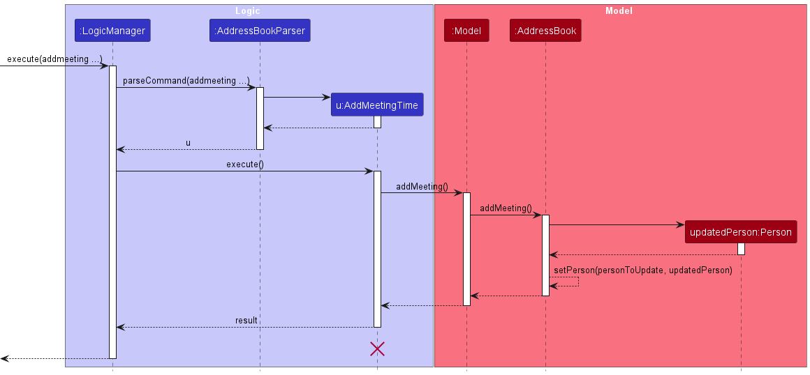
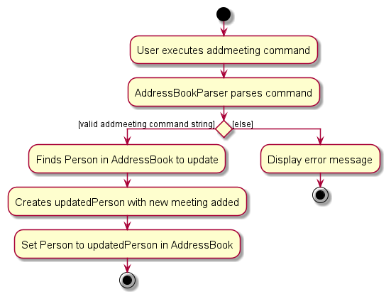

# D.A.V.E. Developer Guide

<!-- * Table of Contents -->
<page-nav-print />

--------------------------------------------------------------------------------------------------------------------

## **Acknowledgements**

This project is based on [AB-3](https://github.com/se-edu/addressbook-level3).

--------------------------------------------------------------------------------------------------------------------
## **Setting up, getting started**

Refer to the guide [_Setting up and getting started_](SettingUp.md).

--------------------------------------------------------------------------------------------------------------------

## **Design**

### Architecture

<div align="center">
    
</div>


The ***Architecture Diagram*** given above explains the high-level design of the App.

Given below is a quick overview of main components and how they interact with each other.

**Main components of the architecture**

**`Main`** (consisting of classes [`Main`](https://github.com/AY2324S1-CS2103T-F08-2/tp/blob/master/src/main/java/seedu/address/Main.java) and [`MainApp`](https://github.com/AY2324S1-CS2103T-F08-2/tp/blob/master/src/main/java/seedu/address/MainApp.java)) is in charge of the app launch and shut down.
* At app launch, it initializes the other components in the correct sequence, and connects them up with each other.
* At shut down, it shuts down the other components and invokes cleanup methods where necessary.

The bulk of the app's work is done by the following four components:

* [**`UI`**](#ui-component): The UI of the App.
* [**`Logic`**](#logic-component): The command executor.
* [**`Model`**](#model-component): Holds the data of the App in memory.
* [**`Storage`**](#storage-component): Reads data from, and writes data to, the hard disk.

[**`Commons`**](#common-classes) represents a collection of classes used by multiple other components.

**How the architecture components interact with each other**

The *Sequence Diagram* below shows how the components interact with each other for the scenario where the user issues the command `delete 1`.


<div align="center">
    
</div>

Each of the four main components (also shown in the diagram above),

* defines its *API* in an `interface` with the same name as the Component.
* implements its functionality using a concrete `{Component Name}Manager` class (which follows the corresponding API `interface` mentioned in the previous point.

For example, the `Logic` component defines its API in the `Logic.java` interface and implements its functionality using the `LogicManager.java` class which follows the `Logic` interface. Other components interact with a given component through its interface rather than the concrete class (reason: to prevent outside component's being coupled to the implementation of a component), as illustrated in the (partial) class diagram below.

<div align="center">
    
</div>

The sections below give more details of each component.

### UI component

The **API** of this component is specified in [`Ui.java`](https://github.com/AY2324S1-CS2103T-F08-2/tp/blob/master/src/main/java/seedu/address/ui/Ui.java)

<div align="center">
    
</div>

The UI consists of a `MainWindow` that is made up of parts e.g.`CommandBox`, `ResultDisplay`, `PersonListPanel`, `StatusBarFooter` etc. All these, including the `MainWindow`, inherit from the abstract `UiPart` class which captures the commonalities between classes that represent parts of the visible GUI.

The `UI` component uses the JavaFx UI framework. The layout of these UI parts are defined in matching `.fxml` files that are in the `src/main/resources/view` folder. For example, the layout of the [`MainWindow`](https://github.com/AY2324S1-CS2103T-F08-2/tp/blob/master/src/main/java/seedu/address/ui/MainWindow.java) is specified in [`MainWindow.fxml`](https://github.com/AY2324S1-CS2103T-F08-2/tp/blob/master/src/main/resources/view/MainWindow.fxml)

The `UI` component,

* executes user commands using the `Logic` component.
* listens for changes to `Model` data so that the UI can be updated with the modified data.
* keeps a reference to the `Logic` component, because the `UI` relies on the `Logic` to execute commands.
* depends on some classes in the `Model` component, as it displays `Person` object residing in the `Model`.

### Logic component

**API** : [`Logic.java`](https://github.com/AY2324S1-CS2103T-F08-2/tp/blob/master/src/main/java/seedu/address/logic/Logic.java)

Here's a (partial) class diagram of the `Logic` component:

<div align="center">
    
</div>

The sequence diagram below illustrates the interactions within the `Logic` component, taking `execute("delete 1")` API call as an example.

<div align="center">
    
</div>

<box type="info" seamless>

**Note:** The lifeline for `DeleteCommandParser` should end at the destroy marker (X) but due to a limitation of PlantUML, the lifeline reaches the end of diagram.
</box>

How the `Logic` component works:

1. When `Logic` is called upon to execute a command, it is passed to an `AddressBookParser` object which in turn creates a parser that matches the command (e.g., `DeleteCommandParser`) and uses it to parse the command.
2. This results in a `Command` object (more precisely, an object of one of its subclasses e.g., `DeleteCommand`) which is executed by the `LogicManager`.
3. The command can communicate with the `Model` when it is executed (e.g. to delete a person).
4. The result of the command execution is encapsulated as a `CommandResult` object which is returned back from `Logic`.

Here are the other classes in `Logic` (omitted from the class diagram above) that are used for parsing a user command:

<div align="center">
    
</div>

How the parsing works:
* When called upon to parse a user command, the `AddressBookParser` class creates an `XYZCommandParser` (`XYZ` is a placeholder for the specific command name e.g., `AddCommandParser`) which uses the other classes shown above to parse the user command and create a `XYZCommand` object (e.g., `AddCommand`) which the `AddressBookParser` returns back as a `Command` object.
* All `XYZCommandParser` classes (e.g., `AddCommandParser`, `DeleteCommandParser`, ...) inherit from the `Parser` interface so that they can be treated similarly where possible e.g, during testing.

### Model component
**API** : [`Model.java`](https://github.com/AY2324S1-CS2103T-F08-2/tp/blob/master/src/main/java/seedu/address/model/Model.java)

<div align="center">
    
</div>

The `Model` component,

* stores the address book data i.e., all `Person` objects (which are contained in a `UniquePersonList` object).
* stores the currently 'selected' `Person` objects (e.g., results of a search/sort query) as a separate _filtered and sorted_ list which is exposed to outsiders as an unmodifiable `ObservableList<Person>` that can be 'observed' e.g. the UI can be bound to this list so that the UI automatically updates when the data in the list change.
* stores a `UserPref` object that represents the user’s preferences. This is exposed to the outside as a `ReadOnlyUserPref` objects.
* does not depend on any of the other three components (as the `Model` represents data entities of the domain, they should make sense on their own without depending on other components)

The following diagram shows the classes that extend the abstract `Person` class.
<div align="center">
    
</div>

The abstract `Person` class is extended by two separate classes, `Lead` and `Client`. These instances are distinguished by their `Type` field in `Person`.
`Lead` objects also contain an additional `KeyMilestone` attribute.
### Storage component

**API** : [`Storage.java`](https://github.com/AY2324S1-CS2103T-F08-2/tp/blob/master/src/main/java/seedu/address/storage/Storage.java)

<div align="center">
    
</div>

The `Storage` component,
* can save both address book data and user preference data in JSON format, and read them back into corresponding objects.
* inherits from both `AddressBookStorage` and `UserPrefStorage`, which means it can be treated as either one (if only the functionality of only one is needed).
* depends on some classes in the `Model` component (because the `Storage` component's job is to save/retrieve objects that belong to the `Model`)

### Common classes

Classes used by multiple components are in the `seedu.addressbook.commons` package.

--------------------------------------------------------------------------------------------------------------------

## **Implementation**

This section describes some noteworthy details on how certain features are implemented.

### View Specific Person feature
Step 1: The user launches the application for the first time. The `SampleAddressBook` will be initialised.

Step 2: The user executes `addclient n/John Doe p/98765432 e/johnd@example.com a/John street, block 123, #01-01` to add a new Client.

Step 3: The user executes a `view 1` command to view the 1st person in the address book. The user’s command is parsed by `ViewCommandParser` which extracts the target index. The `ViewCommand` class is instantiated with the extracted index. `ViewCommand` class interacts with `Model#FilteredPersonList` to verify the validity of the index and retrieve the corresponding person’s details. The command execution would be encapsulated as a `CommandResult` object that is then returned back from `Logic`.

**Note:** If the index given is more than the size of the list or when the index given is 0, `ViewCommand` will not call `Model#view(Person personToView)`. Instead, a `MESSAGE_INVALID_PERSON_DISPLAYED_INDEX` exception will be thrown. The Main Window display continue displaying the `PersonListPanel` UI instead of the  `ViewWindow` UI

The following sequence diagram shows how the View Command works:
<div align="center">
    
</div>

### Add client/Add lead feature

#### Implementation

The `Client` and `Lead` model extends from `Person`.
The `Client` and `Lead` model has a name, address, phone number, email field which is compulsory, as well as a meeting time and tags field which are optional.
The `Lead` model has an additional compulsory field called Key Milestone.

Given below is an example usage scenario and how `addclient` and `addlead` behaves at each step.

Step 1. The user launches the application for the first time. The `AddressBook` will be initialized.

<div align="center">
    
    <p>Before any commands</p>
</div>

Step 2a - `addclient`. The user executes `addclient n/John Doe...` command add a person named John Doe into the AddressBook. The `addclient` command calls `Model#addClient()`, causing the address book to be updated.

<div align="center">
    
    <p>After addclient command</p>
</div>

Step 2b - `addlead`. The user executes `addlead n/John Doe...` command add a person named John Doe into the AddressBook. The `addlead` command calls `Model#addLead()`, causing the address book to be updated.

<div align="center">
    
    <p>After addlead command</p>
</div>

The following sequence diagram shows how the `addclient` operation works (Note that `addlead` works in the same way but calls `Model#addLead()` instead):
<div align="center">
    
</div>

The following activity diagram shows the workflow upon execution of the `addclient` command (`addlead` works the same way):
<div align="center">
    
</div>

### Add Meeting Time feature

#### Implementation

The user can specify a meeting time when executing `addclient` or `addlead` command with the `m/` flag or enter the `addmeeting` command to add a meeting time to an existing client or lead.
The `addmeeting` command takes in the index of the client or lead, and the meeting time in `dd/MM/yyyy HH:mm` format (e.g. `addmeeting 1 12/12/2023 12:00`).
The `AddMeetingCommand` class facilitates this by copying the person (client/lead) based on the index given, and creates a new person with the meeting time added.
The `AddMeetingCommand` class then calls `Model#setPerson()` to update the address book with the new person.

The following sequence diagram shows how the `addmeeting ...` operation works:

<div align="center">
    
</div>

The following activity diagram shows the workflow of the execution of the `addmeeting ...` command:

<div align="center">
    
</div>

### List clients and leads feature

#### Implementation

The user can view a filtered list of clients or leads when executing `listclient` or `listlead` command respectively. These commands are implemented as follows:

The `execute()` command in `ListClientCommand` or `ListLeadCommand` is executed.

The `execute()` command in `ListClientCommand` or `ListLeadCommand` iterates over the `persons` list in the `ModelManager` object.

For each person in the persons list, the `isClient()` function is used to check if the person is a `Client` for `ListClientCommand` and `isLead()` function is used to check if the person is a `Lead` for `ListLeadCommand`.

If the person is a `Client` or `Lead` object, depending on the command `ListClientCommand` or `ListLeadCommand`, would filter the list, and the GUI would display the filtered list.

Given below is an example usage scenario and how `listclient` and `listlead` behaves at each step.

Step 1. The user opens the application to see a list of leads and clients.

Step 2. The user executes `listclient` command to display a filtered list of persons in the address book. The `listclient` command calls `Model#updateFilteredPersonList()`, causing the modified state of the filtered list to be displayed based on the `predicate` passed into the `Model#updateFilteredPersonList()`.

The following sequence diagram shows how the `listclient` operation works (Note that `listlead` works in the same way:

<div align="center">
    
    <p>After addlead command</p>
</div>

###  Convert lead to client and client to lead feature

#### Implementation

The user can convert client to leads  and vice versa, using  the command `converttolead` and `converttoclient` respectively.

The `execute()` command in `ConvertLeadToClientCommand` or `ConvertClientToLeadCommand` is executed.

The `execute()` command in `ConvertLeadToClientCommand` or `ConvertClientToLeadCommand` takes in an argument of type `Index`, and is referred to the list of items

If the person is a `Lead` when using `converttoclient`, the application would create a new `Client` object with the information from `Lead` class. Similarly, this also would occur for `converttolead`

Given below is an example usage scenario and how `converttoclient` and `converttolead` behaves at each step

<div align="center">
    
    <p>After converttoclient command</p>
</div>

The following activity diagram shows what happens when a user executes `converttoclient`:
<div align="center">
    
    <p>After converttoclient command</p>
</div>

### Sort Meeting Time feature

#### Implementation

The user can view the upcoming meetings scheduled with leads and clients sorted in chronological order. The command is implemented as follows.

The `execute()` command in `SortMeetingTimeCommand` calls the `sortFilteredPersonList()` in `Model`, which first filters and returns a `FilteredList` containing only persons with a meeting time.
This list is then sorted using the `PersonMeetingTimeComparator` to obtain the desired `SortedList` output, which is then displayed.

Note that in every other operation that updates the `ObservableList` to be displayed, the `null` comparator is used instead of the `PersonMeetingTimeComparator` so no sorting occurs.

The following sequence diagram shows how the `sortmeeting` operation works:

<div align="center">
    
</div>

--------------------------------------------------------------------------------------------------------------------

## **Documentation, logging, testing, configuration, dev-ops**

* [Documentation guide](Documentation.md)
* [Testing guide](Testing.md)
* [Logging guide](Logging.md)
* [Configuration guide](Configuration.md)
* [DevOps guide](DevOps.md)

--------------------------------------------------------------------------------------------------------------------

## **Appendix: Requirements**

### Product scope

**Target user profile**:

* is a student financial advisor
* has a need to manage a significant number of contacts
* prefer desktop apps over other types
* can type fast
* prefers typing to mouse interactions
* is reasonably comfortable using CLI apps
* needs a solution that offers robust client relationship management
* needs event and policy tracking

**Value proposition**: to keep track of their leads as well as clients' details such as their insurance policies, expiry, coverage, personal and contact details, to better assist their leads and clients.


### User stories
<!--
Priorities: High (must have) - `* * *`, Medium (nice to have) - `* *`, Low (unlikely to have) - `*`

| Priority | As a …​                                    | I want to …​                 | So that I can…​                                                        |
|----------|--------------------------------------------|------------------------------|------------------------------------------------------------------------|
| `* * *`  | new user                                   | see usage instructions       | refer to instructions when I forget how to use the App                 |
| `* * *`  | user                                       | add a new person             |                                                                        |
| `* * *`  | user                                       | delete a person              | remove entries that I no longer need                                   |
| `* * *`  | user                                       | find a person by name        | locate details of persons without having to go through the entire list |
| `* *`    | user                                       | hide private contact details | minimize chance of someone else seeing them by accident                |
| `*`      | user with many persons in the address book | sort persons by name         | locate a person easily                                                 |
-->
### Leads

| Priority | As a                      | I want to …​                                             | So that I can…​                                                                |
|----------|---------------------------|----------------------------------------------------------|--------------------------------------------------------------------------------|
| `* * *`  | student financial advisor | view all my leads                                        | recall and focus on all my leads                                               |
| `* * *`  | student financial advisor | add a lead                                               | keep track of my leads and their information                                   |
| `* * *`  | student financial advisor | edit the details of my leads                             | update changes in information of my lead                                       |
| `* * *`  | student financial advisor | remove leads that I have unsuccessfully followed up with | prevent cluttering up my address book                                          |
| `* * *`  | student financial advisor | convert leads into clients                               | update my lead as a client if I have successfully converted them into a client |
| `* *`    | student financial advisor | add a meeting time with my lead                          | keep track of when I need to visit my leads                                    |
| `* *`    | student financial advisor | delete a meeting time with my lead                       | update D.A.V.E. with accurate information of my upcoming meetings              |

### Clients

| Priority | As a student...           | I want to …​                                              | So that I can…​                                                                                                                          |
|----------|---------------------------|-----------------------------------------------------------|------------------------------------------------------------------------------------------------------------------------------------------|
| `* * *`  | student financial advisor | view all my clients                                       | recall and focus on all my clients                                                                                                       |
| `* * *`  | student financial advisor | add a client                                              | keep track of my clients and their information                                                                                           |
| `* * *`  | student financial advisor | edit the details of my clients                            | update changes in information of my client                                                                                               |
| `* * *`  | student financial advisor | remove clients who do not continue their services with me | prevent cluttering up my address book                                                                                                    |
| `* *`    | student financial advisor | add a meeting time with my client                         | more easily schedule meetings with clients to update their policies and keep up with their life                                          |
| `* *`    | student financial advisor | delete a meeting time with my client                      | update D.A.V.E. with accurate information of my upcoming meetings                                                                        |
| `* *`    | student financial advisor | convert clients into leads                                | undo the conversion of a lead into client, or continue tracking this person as a lead after he/she has discontinued his/her plan with me |

### General Information

| Priority | As a student financial advisor, | I want to …​                                   | So that I can…​                                                                                        |
|----------|---------------------------------|------------------------------------------------|--------------------------------------------------------------------------------------------------------|
| `* * *`  | student financial advisor       | view all my clients and leads                  | recall and focus on all my clients and leads                                                           |
| `* * *`  | student financial advisor       | sort meeting times with clients and leads      | see my upcoming meetings in chronological order to better plan my time                                 |
| `* *`    | student financial advisor       | save details automatically while using the app | focus on updating D.A.V.E. with information of my clients and leads without worrying about saving data |


### Planned Enhancement
| Priority | As a student financial advisor, | I want to …​                                   | So that I can…​                                                                        |
|----------|---------------------------------|------------------------------------------------|----------------------------------------------------------------------------------------|
| `* *`    | student financial advisor       | add a policy for my clients                    | keep track of their policies and access them readily                                   |
| `* *`    | student financial advisor       | edit the details of my clients' policies       | update changes in information of my clients' policies                                  |
| `* *`    | student financial advisor       | delete a policy for my clients                 | remove policies that my clients no longer have to keep my clients' policies up-to-date |
| `*`      | student financial advisor       | see the expiry of my clients' policies         | keep track of my clients' policies and follow up with them when necessary              |

### Use cases

(For all use cases below, the **System** is the `D.A.V.E.` and the **Actor** is the `user`, unless specified otherwise)

**Use case: Delete a person**

**MSS**

1.  User requests to list persons.

2.  D.A.V.E. shows a list of persons.

3.  User requests to delete a specific person in the list.

4.  D.A.V.E. deletes the person.

    Use case ends.

**Extensions**

    2a. The list is empty.

        Use case ends.

    3a. The given index is invalid.

        3a1. D.A.V.E. shows an error message.

        Use case resumes at step 3.

**Use case: Edit Key Milestone of Lead**

**MSS**

1. User requests to list leads.

2. D.A.V.E. shows a list of leads.

3. User requests to see a specific lead.

4. D.A.V.E. shows information of the lead.

5. User types in index of lead and the new key milestone date.

6. D.A.V.E. updates the lead's information.

7. D.A.V.E. displays lead's information.

Use case ends.

**Extensions**

    2a. The list of leads is empty.
    
        Use case ends.

    5a. The given index is a client.

        5a1. D.A.V.E. shows an error message indicating that clients do not have key milestone field.
        
        5a2. User keys in new index and key milestone.

        Step 5a1-5a2 is repeated until a valid index and key milestone is given.

        Use case resumes at step 6.

    5b. The given key milestone date is identical to the current key milestone date of the lead.
        
        5b1. D.A.V.E. displays a message that the lead's information has been edited, maintaining the same date for the key milestone.

        Use case resumes at step 7.

**Use case: Add new client**

**MSS**

1. User requests to add a new client.

2. D.A.V.E. prompts the user to input the client's information.

3. User enters the client's details.

4. D.A.V.E. saves the new client's information.

5. User views the added client.

6. D.A.V.E. displays the selected client's details.

Use case ends.

**Extensions**

    3a. The client already exists in the list.

        Use case ends.

    3b. The user did not key in all the required client information fields.
    
        3b1. D.A.V.E. displays an error message indicating an invalid command format.

        3b2. User keys in new client information.

        Step 3b1-3b2 is repeated until all the client information fields are keyed in correctly.

        Use case resumes at step 4.

**Use case: Schedule a Meeting**

**MSS**

1. User requests to list persons.

2. D.A.V.E. displays a list of persons.

3. User selects a specific person.

4. User requests to schedule a meeting with the selected person.

5. D.A.V.E. prompts the user to enter meeting details (date and time).

6. User provides meeting details.

7. D.A.V.E. schedules the meeting and updates the person's information.

Use case ends.

**Extensions**

    2a. The list of persons is empty. 

        Use case ends.
    
    4a. The given index is invalid.
      
      4a1. D.A.V.E. shows an error message.
     
      4a2. D.A.V.E. requests for valid index.

      4a3. User enters new data for the meeting details.

      Steps 4a1-4a3 are repeated until the index entered is correct.

      Use case resumes at step 5.

    6a. The user enters invalid meeting details.

        6a1. D.A.V.E. shows an error message.
        
        6a2. D.A.V.E. requests for valid meeting details.
        
        6a3. User enters new data for the meeting details.
        
        Steps 6a1-6a3 are repeated until the meeting time data entered is correct.

        Use case resumes at step 7.

    6b. The person the user selected already has a meeting scheduled.

        6b1. D.A.V.E. shows an error message requesting user to edit current meeting time instead of adding new meeting time.
        
        6b2. User edits the current meeting time instead of adding a new meeting time.

        Use case resumes at step 7.

**Use case: Search for a Person**

**MSS**

1. User requests to search for a specific person.

2. D.A.V.E. prompts the user to enter person's name.

3. User provides person's full name.

4. D.A.V.E. performs a search and displays a list of containing only the specified person.

5. User views the person from the search results.

6. D.A.V.E. shows the selected person's details.

Use case ends.

**Extensions**
    
    2a. User only provides the surname of the person.
        
        2a1. D.A.V.E. performs a search and displays a list with all the people with the same surname.
        
        2a2. User narrows down the search by typing the full name.

        Use case resumes at step 4.

    2b. User provides more than one name.
    
        2b1. D.A.V.E. performs a search and displays a list with all the people whose name contains the input names.
        
        2b2. User narrows down the search by typing the full name of the specific person.

        Use case resumes at step 4.

    4a. No persons match the search criteria.

        4a1. D.A.V.E. displays a message indicating no matches found.

        Use case ends.

**Use case: List Clients**

**MSS**
1. User requests to list clients.

2. D.A.V.E. filters the list of Persons to a list of clients.

3. D.A.V.E. displays the list of clients to the user.

Use case ends.

**Extensions**

    3a. The list of clients is empty.

        3a1. D.A.V.E. display a message indicating all clients are displayed.

        3a2. No information is displayed.

        Use case ends.

**Use case: Convert a Lead to Client**

**MSS**
1. User requests to convert a lead to a client.

2. D.A.V.E. prompts user to type in the lead's index.

3. User types in lead's index.

4. D.A.V.E. successfully converts the lead to a client.

Use case ends.

**Extensions**

    3a. User gives an index of a client.

        3a1. D.A.V.E. displays an error message indicating that the person at the given index is a client.

        3a2. User types in another index.

        Step 3a1-3a2 is repeated until user enters a valid index.
        
        Use case resumes at step 4.

    3b. The given index is invalid.
        
        3b1. D.A.V.E. displays an error message indicating invalid index provided.

        3b2. User types in new index.

        Step 3b1-3b2 is repeated until user enters a valid index.
        
        Use case resumes at step 4.

**Use case: List Leads**

**MSS**
1. User requests to list leads.

2. D.A.V.E. filters the list of Persons to a list of leads.

3. D.A.V.E. displays the list of leads to the user.

Use case ends.

**Extensions**

    3a. The list of leads is empty.
       
        3a1. D.A.V.E. displays a message indicating all clients are displayed.
        
        Use case ends.

**Use case: Sort Meeting Time**

**MSS**
1. User requests to sort meeting time.

2. D.A.V.E. sorts the list of clients and leads based off their meeting times in chronological order.

3. D.A.V.E. displays the sorted list to the user.

Use case ends.

**Extensions**

    3a. Some of the clients and leads have the same meeting date and time.
        
        3a1. D.A.V.E. first sorts the list based off their meeting date and time, then according to who was added the earliest.
        
        3a2. D.A.V.E. displays the sorted list to the user.
        
        Use case ends.

    3b. The list of persons is empty.
        
        3b1. D.A.V.E. displays a message indicating all meeting times are sorted.
        
        3b2. No information is displayed.
        
        Use case ends.

### Non-Functional Requirements

1.  Should work on any _mainstream OS_ as long as it has Java `11` or above installed.
2.  Should be able to hold up to 1000 persons without a noticeable sluggishness in performance for typical usage.
3.  A user with above average typing speed for regular English text (i.e. not code, not system admin commands) should be able to accomplish most of the tasks faster using commands than using the mouse.
4. The system should be able to scale gracefully to accommodate a growing number of users, clients, and data without significant performance degradation.
8. The user interface should be intuitive and user-friendly, ensuring that users can quickly learn and navigate the application.
9. The application should be able to store and retrieve data accurately without data loss.
10. The app should respond to the user actions within 2 seconds.

### Glossary

* **Mainstream OS**: Windows, Linux, Unix, OS-X
* **Private contact detail**: A contact detail that is not meant to be shared with others
* **Graceful scaling**: Ability for the system to handle increased user loads without significant performance loss
* **Integration**: Combining different software components together to easily incorporate additional modules or features as needed
--------------------------------------------------------------------------------------------------------------------

## **Appendix: Instructions for manual testing**

Given below are instructions to test the app manually.

<box type="info" seamless>

**Note:** These instructions only provide a starting point for testers to work on;
testers are expected to do more *exploratory* testing.

</box>

### Launch and shutdown

1. Initial launch

    1. Download the jar file and copy into an empty folder

    1. Double-click the jar file Expected: Shows the GUI with a set of sample contacts. The window size may not be optimum.

1. Saving window preferences

    1. Resize the window to an optimum size. Move the window to a different location. Close the window.

    1. Re-launch the app by double-clicking the jar file.<br>
       Expected: The most recent window size and location is retained.

1. _{ more test cases …​ }_

### Add a client

1. Add a client with a necessary fields

    1. Prerequisites: List all clients/leads using the `list` command. The information about the lead to be added should not already exist in the list.

    1. Test case: `addclient n/John Doe p/98765432 e/johnd@example.com a/311, Clementi Ave 2, #02-25 t/classmate`
       Expected: A client with the information above will be added.

    1. Test case: `addclient p/98765432 e/johnd@example.com a/311, Clementi Ave 2, #02-25 t/classmate`
       Expected: No client will be added. The following error message will be shown.
    ```
    Invalid command format!
    addclient: Adds a client to the address book. Parameters: n/NAME p/PHONE e/EMAIL a/ADDRESS [t/TAG]...
    Example: addclient n/John Doe p/98765432 e/johnd@example.com a/311, Clementi Ave 2, #02-25 t/classmate
    ```
1. _{ more test cases …​ }_


### Add a lead

1. Add a lead with a necessary fields

    1. Prerequisites: List all clients/leads using the `list` command. The information about the lead to be added should not already exist in the list.

    1. Test case: `addlead n/John Doe p/98765432 e/johnd@example.com a/311, Clementi Ave 2, #02-25 t/classmate`
       Expected: A lead with the information above will be added.

    1. Test case: `addlead p/98765432 e/johnd@example.com a/311, Clementi Ave 2, #02-25 t/classmate`
       Expected: No lead will be added. The following error message will be shown.
    ```
    Invalid command format!
    addlead: Adds a lead to the address book. Parameters: n/NAME p/PHONE e/EMAIL a/ADDRESS [t/TAG]...
    Example: addlead n/John Doe p/98765432 e/johnd@example.com a/311, Clementi Ave 2, #02-25 t/classmate
    ```
1. _{ more test cases …​ }_

### Edit a client/lead

1. Deleting a client/lead while all clients/leads are being shown

   1. Prerequisites: List all clients/leads using the `list` command. Multiple clients/leads in the list.

   1. Test case: `edit 1 n/Alan`<br>
      Expected: The name of first contact is edited to ``Alan``. Details of the edited contact shown in the status message.

   1. Test case: `edit 1`<br>
      Expected: No client/lead is edited. Error details shown in the status message.

   1. Test case: `edit 0`<br>
      Expected: No client/lead is edited. Error details shown in the status message.

1. _{ more test cases …​ }_

### Deleting a client/lead

1. Deleting a client/lead while all clients/leads are being shown

   1. Prerequisites: List all clients/leads using the `list` command. Multiple clients/leads in the list.

    1. Test case: `delete 1`<br>
       Expected: First contact is deleted from the list. Details of the deleted contact shown in the status message. Timestamp in the status bar is updated.

   1. Test case: `delete 0`<br>
      Expected: No client/lead is deleted. Error details shown in the status message. Status bar remains the same.

    1. Other incorrect delete commands to try: `delete`, `delete x`, `...` (where x is larger than the list size)<br>
       Expected: Similar to previous.

1. _{ more test cases …​ }_

### Viewing a person

1. Viewing a person while all persons are being shown

    1. Prerequisites: List all persons using the `list` command. Multiple persons in the list.

    1. Test case: `view 0`<br>
       Expected: Entire list remains displayed. Error details shown in status message. Status bar remains the same.
    1. Other incorrect view commands to try: `view`, `view x` (where x is larger than the list size, or x is a negative index)<br>
       Expected: Similar to previous.
    1. Test case: `view 1`, `view x` (where x is an integer within the size of the list) <br>
       Expected: The full details of the first person is displayed. Success message: `Viewed Person Successfully`

### Converting a lead to client

1. Converting a lead to a client

   1. Prerequisites: At least one client shown on the interface.
   2. Test case: `converttoclient 1`<br>
      Expected: Person changes from a lead to a client
   3. Test case: `converttoclient 0`<br>
      Expected: No change to any information. Error details shown in status message. Status bar remains the same.
   4. Other incorrect convert commands to try: `converttoclient`, `converttoclient x` (where x is larger than the list size)<br>
      Expected: Similar to previous
### Converting a client to lead

1. Similar to converting a lead to client, but for client to lead


### Saving data

1. Dealing with missing/corrupted data files

    1. _{explain how to simulate a missing/corrupted file, and the expected behavior}_

1. _{ more test cases …​ }_


--------------------------------------------------------------------------------------------------------------------

## **Appendix: Planned Enhancements**

1. **Client Policy Management:** The current functionality falls short in allowing student financial advisors to monitor clients' policies and follow up as needed, as it lacks the ability to add, edit, and delete client policies.  To address this limitation, we intend to develop these features in the future, ensuring student financial advisors can efficiently manage policy-related tasks.
