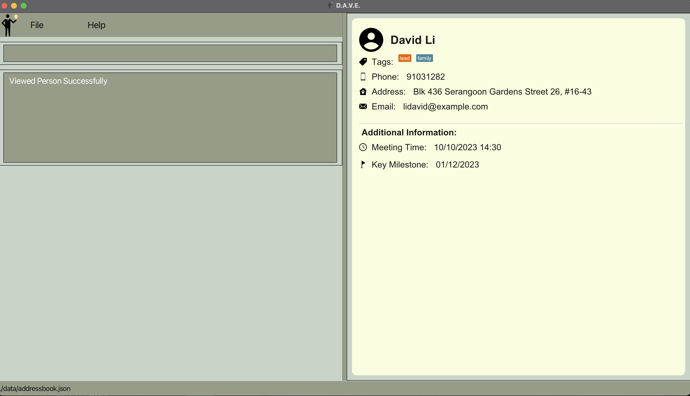
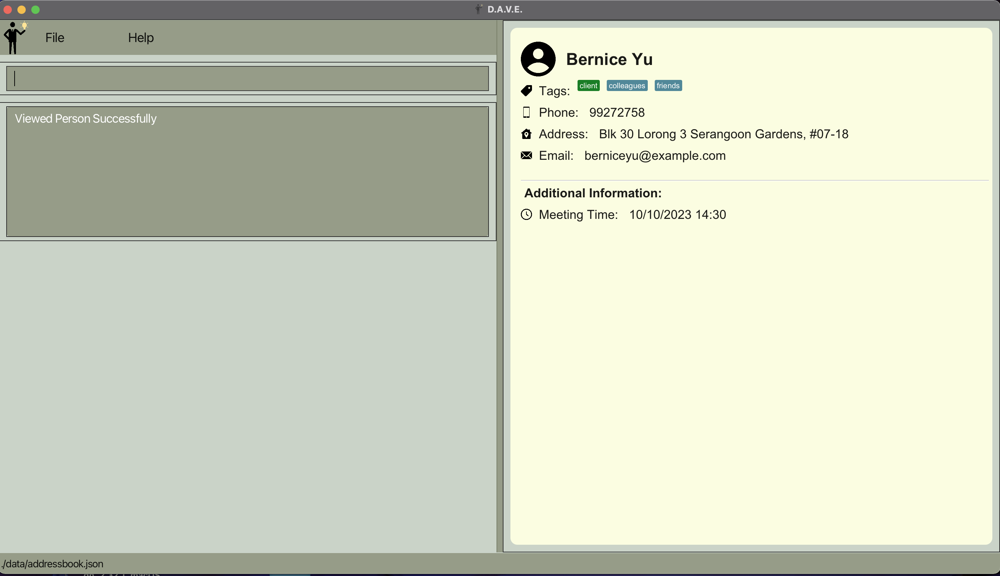
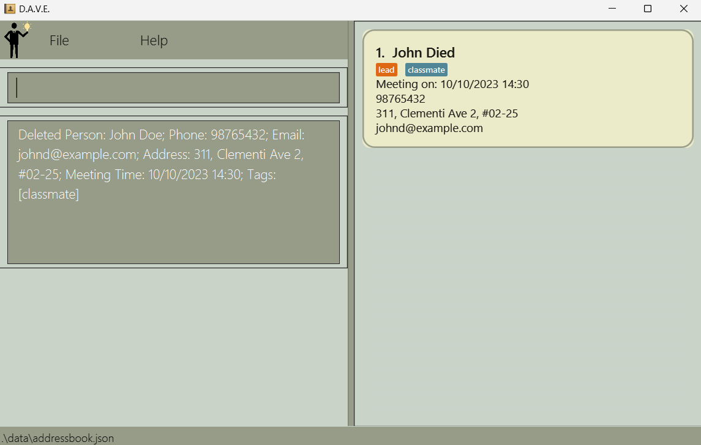
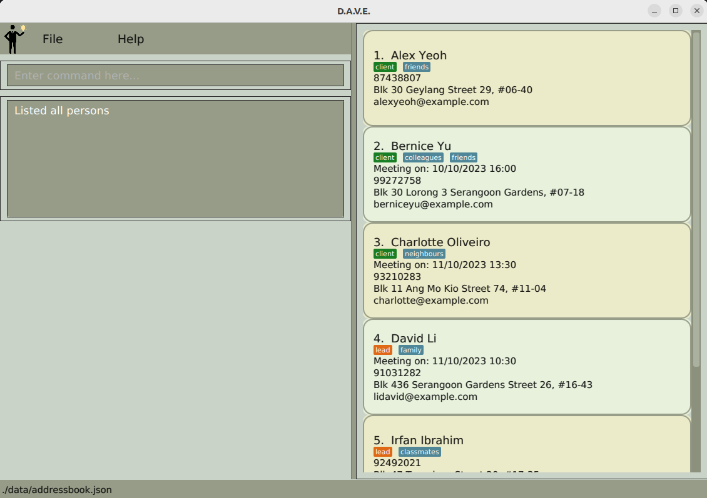
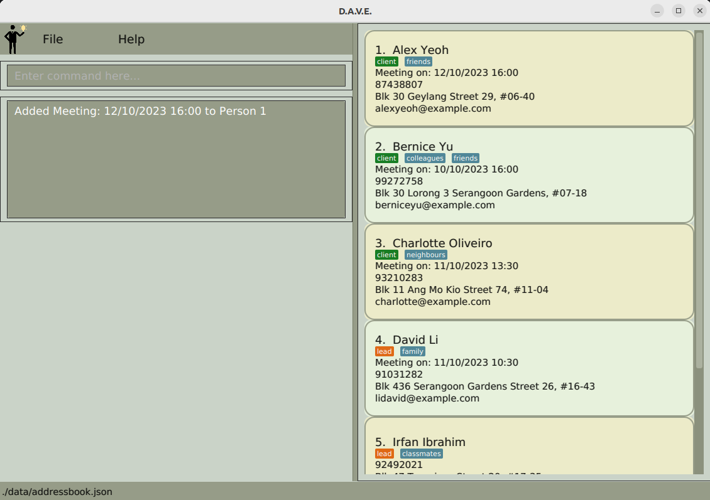
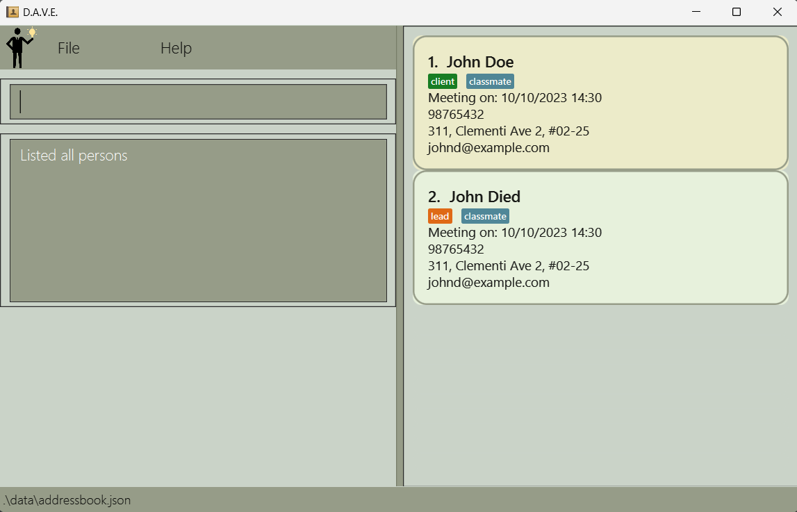
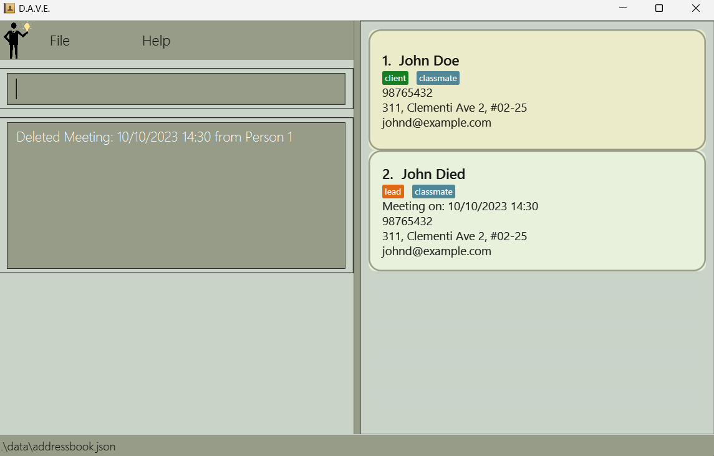
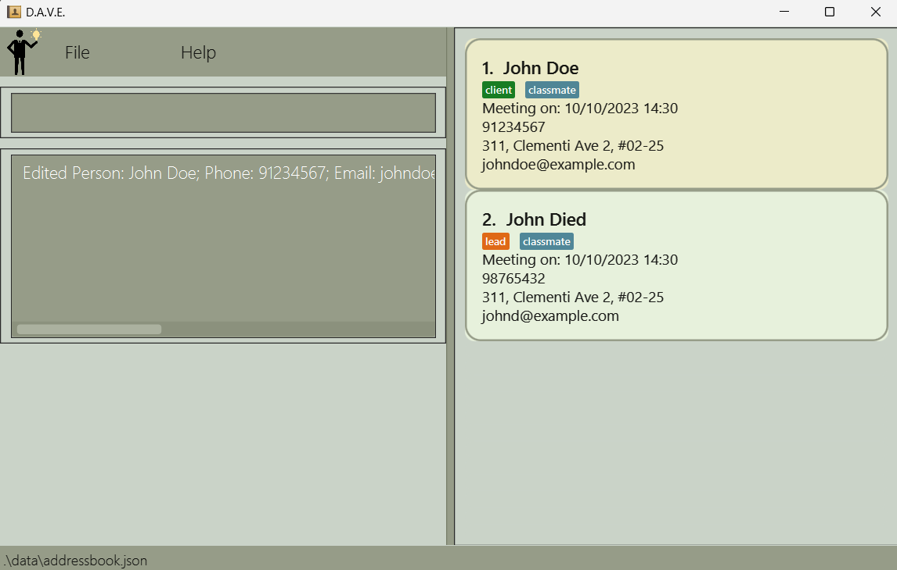
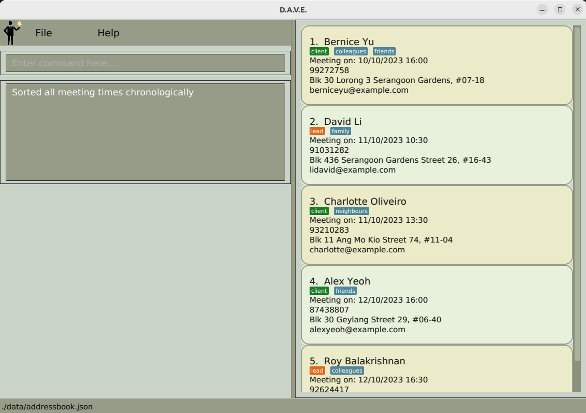

  # Welcome to D.A.V.E. (**D**’financial **A**d**V**isor **E**xpert)

*Manage your leads and clients information effortlessly through D.A.V.E. to gain an edge in your FA journey!*

D.A.V.E. is a leads and clients management tool for student financial advisors specifically in NUS, but can be used for all student financial advisors.

Here’s a quick overview of D.A.V.E.’s features

- Store and edit information of your leads and clients
- Convert successful leads into clients
- Manage clients’ policies
- Delete policies and leads
- Reminders such as upcoming meetings with leads/clients

# Table of Contents

- [Glossary](#Glossary)
- [Tutorial for new users](#D.A.V.E.-Tutorial-for-new-users)
- [Features](#Features)
- [FAQ](#faq)
- [Known issues](#known-issues)

# Glossary

## Definitions

Here are some descriptions of the words we use throughout the User Guide:

| Term | Definition |
| --- | --- |
| Command | An input from the user that tells D.A.V.E. to perform an action (e.g. add a client). |
| GUI | Graphical User Interface (GUI) refers to the visual display of D.A.V.E that users can see. |
| CLI | Command Line Interface (CLI) represents a text-based user interface to interact with the application. |

# D.A.V.E. Tutorial for new users

1. Ensure you have Java `11` or above installed in your computer.
2. Download the latest `DAVE.jar` from here.
3. Copy the file to the folder you want to use as the *home folder* for D.A.V.E.
4. Double-click `DAVE.jar` to start the app.

# Features

### Add lead

- What it does: Add potential leads and their basic information, e.g. name, age, year of study, major, etc.
- Command format: `addlead n/NAME p/PHONE e/EMAIL a/ADDRESS k/KEY_MILESTONE [m/MEETING_TIME] [t/TAG]...`.
- Example usage: `Example: addlead n/John Doe p/98765432 e/johnd@example.com a/311, Clementi Ave 2, #02-25 k/01/12/2023 m/10/10/2023 14:30 t/classmate`.
- Acceptable values for each compulsory parameter:
    - `NAME`: can contain any string of alphanumeric characters.
      - The name can contain spaces but cannot be blank (only contain spaces).
    - `PHONE`: any valid 8-digit integer, at least 3 digits long.
    - `EMAIL`: a string of the format `local-part@domain`
      - The local-part should only contain alphanumeric characters and these special characters, excluding the parentheses, (+_.-). 
      - The local-part may not start or end with any special characters. 
      - The domain name is made up of domain labels separated by periods.
      - The domain name must end with a domain label at least 2 characters long
      - Each domain label must start and end with alphanumeric characters and only separated by hyphens, if any.
    - `ADDRESS`: can contain any alphanumeric character, must not be blank.
    - `KEY_MILESTONE`: only contains date in the format of `dd/MM/yyyy`
      - ``KEY_MILESTONE`` is the date of a lead's life-changing event.
      - The date must be a valid date, these are invalid: `31/02/2020`, `25/13/2021`
- Acceptable values for each optional parameter:
    - `MEETING_TIME`: only contains date in the format of `dd/MM/yyyy HH:mm`
      - The date must be a valid date, these are invalid: `31/02/2020`, `25/13/2021`
      - The time must be a valid time in the 24-hour format, these are invalid: `25:00`, `12:60`
    - `TAG`: can contain any alphanumeric character, must not be blank if any tag is declared.
- Precise expected outputs when the command succeeds:

<div align="center">
    
    <p>After using addlead command</p>
</div>

- Precise expected outputs when the command fails:

```
Invalid command format! 
addlead: Adds a lead to the address book. Parameters: n/NAME p/PHONE e/EMAIL a/ADDRESS k/KEY_MILESTONE m/MEETING_TIME [t/TAG]...
Example: addlead n/John Doe p/98765432 e/johnd@example.com a/311, Clementi Ave 2, #02-25 k/01/12/2023 m/10/10/2023 14:30 t/classmate
```

### Add Client
- What it does: Add potential clients and their basic information, e.g. name, age, year of study, major, etc.
- Command format: `addclient n/NAME p/PHONE e/EMAIL a/ADDRESS [m/MEETING_TIME] [t/TAG]...`.
- Example usage: `Example: addclient n/John Doe p/98765432 e/johnd@example.com a/311, Clementi Ave 2, #02-25 m/10/10/2023 14:30 t/classmate`.
- Acceptable values for each compulsory parameter:
  - `NAME`: can contain any string of alphanumeric characters.
    - The name can contain spaces but cannot be blank (only contain spaces).
  - `PHONE`: any valid 8-digit integer, at least 3 digits long.
  - `EMAIL`: a string of the format `local-part@domain`
    - The local-part should only contain alphanumeric characters and these special characters, excluding the parentheses, (+_.-).
    - The local-part may not start or end with any special characters.
    - The domain name is made up of domain labels separated by periods.
    - The domain name must end with a domain label at least 2 characters long
    - Each domain label must start and end with alphanumeric characters and only separated by hyphens, if any.
  - `ADDRESS`: can contain any alphanumeric character, must not be blank.
- Acceptable values for each optional parameter:
  - `MEETING_TIME`: only contains date in the format of `dd/MM/yyyy HH:mm`, must not be blank if any meeting time is declared.
    - The date must be a valid date, these are invalid: `31/02/2020`, `25/13/2021`
    - The time must be a valid time in the 24-hour format, these are invalid: `25:00`, `12:60`
  - `TAG`: can contain any alphanumeric character, must not be blank if any tag is declared.

- Precise expected outputs when the command succeeds:

<div align="center">
    
    <p>Before using addclient command</p>
</div>

<div align="center">
    
    <p>After using addclient command</p>
</div>

- Precise expected outputs when the command fails:

```
Invalid command format!
addclient: Adds a client to the address book. Parameters: n/NAME p/PHONE e/EMAIL a/ADDRESS [t/TAG]...
Example: addclient n/John Doe p/98765432 e/johnd@example.com a/311, Clementi Ave 2, #02-25 m/10/10/2023 14:30 t/classmate
```

### View all clients

- What it does: View all clients you have stored, including their basic information and index in the list of clients, e.g. id, name, age, gender, occupation, etc.
- Command: `listclient`.
- Precise expected outputs when the command succeeds:

In output section of the
`List of all clients`

<h4>Examples of usage:</h4>

<div align="center">
    
    <p>List of leads and clients</p>
    
    <p>After using listclient command</p>
</div>

### View all leads

- What it does: View all leads you have stored, including their basic information and index in the list of leads, e.g. id, name, age, gender, occupation, etc.
- Command: `listlead`.
- Precise expected outputs when the command succeeds:

`List of all leads`

<h4>Example usage:</h4>

<div align="center">
    
    <p>List of leads and clients</p>
    
    <p>After using listlead command</p>
</div>

### View Specific Person

- What it does: View a specific person that you have stored, including their basic information and another relevant lead/client
  details that are not displayed in the main address list.
- Command: `view INDEX`.
- Example usage: `view 1`.
- Acceptable values for `INDEX` parameter:
  - Must be an integer from `1` to the last index of the main list.
- Precise expected output when the command succeeds:

`Viewed Person Successfully`

- Precise expected output when command fails:

`The person index provided is invalid`

<h4>Example usage:</h4>

<div align="center">
    
    <p>After using View Command on a Lead</p>
</div>

<div align="center">
    
    <p>After using View Command on a Client</p>
</div>

### Delete

- What it does: Deletes a lead from your list of leads.
- Command format: `delete INDEX`.
- Example usage: `delete 1`.

<div align="center">
    
    <p>Before delete</p>
</div>

<div align="center">
    
    <p>After delete</p>
</div>

- Acceptable values for `INDEX` parameter:
    - Must be an integer from `1` to the last index of the leads list
- Precise expected outputs when the command succeeds:

`Deleted person: <person details>`

- Precise expected outputs when the command fails:

```
Invalid command format!
delete: Deletes the person identified by the index number used in the displayed person list.
Parameters: INDEX (must be a positive integer)
```

### Add meeting time

- What it does: Adds a meeting time to a person.
- Command format: `addmeeting INDEX m/MEETING_TIME`
- Example usage: `addmeeting 1 m/12/10/2023 16:00`

<div align="center">
    
    <p>Before using addmeeting</p>
</div>

<div align="center">
    
    <p>After using addmeeting</p>
</div>

- Acceptable values for each parameter:
    - `INDEX`: Any integer from `1` to the last index of the displayed list.
    - `MEETING_TIME`: A string of format `dd/MM/yyyy HH:mm`.
- Precise expected outputs when the command succeeds:

`Added Meeting: <meeting datetime> to Person <index>`

- Precise expected outputs when the command fails:

When adding a meeting time to an invalid index or with an invalid datetime format:  
```
Invalid command format!
addmeeting: Adds a new meeting time to the person identified by the displayed index in the address book.
Parameters: INDEX (must be a positive integer) m/MEETING_TIME
Example: addmeeting 1 m/12/10/2023 16:00
```

When adding a meeting time to a person who already has an existing meeting:
`Person already has a meeting time, use the edit command instead`

### Delete meeting time

- What it does: Delete a meeting time for meetings that has been cancelled or postponed.
- Command format: `deletemeeting INDEX`
- Example usage: `deletemeeting 1`

<div align="center">
    
    <p>Before using deletemeeting</p>
</div>

<div align="center">
    
    <p>After using deletemeeting</p>
</div>

- Acceptable values for each parameter:
    - `INDEX`: Any integer from `1` to the last index of the filtered list shown in the addressbook.
- Precise expected outputs when the command succeeds:
```
Deleted Meeting: <MEETING_TIME> from Person <INDEX>
```
- Precise expected outputs when the command fails:
```
Invalid command format! 
deletemeeting: Deletes the meeting identified by the index number used in the displayed meeting list.
Parameters: INDEX (must be a positive integer)
Example: deletemeeting 1
```


### Edit 

- What it does: Edit the details of a lead or client.
- Command format: `edit INDEX [n/NAME] [p/PHONE] [e/EMAIL] [a/ADDRESS] [k/KEY_MILESTONE] [t/TAG]...`
- Example usage: `edit 1 n/John Doe p/98765432`

<div align="center">
    
    <p>Before using edit</p>
</div>

<div align="center">
    
    <p>After using edit</p>
</div>

- Acceptable values for each compulsory parameter:
    - `INDEX`: Any integer from `1` to the last index of the filtered list shown in the addressbook.
- Acceptable values for each optional parameter (at least one of the optional parameters must be provided)
  - `NAME`: can contain any string of alphanumeric characters.
    - The name can contain spaces but cannot be blank (only contain spaces).
  - `PHONE`: any valid 8-digit integer, at least 3 digits long.
  - `EMAIL`: a string of the format `local-part@domain`
    - The local-part should only contain alphanumeric characters and these special characters, excluding the parentheses, (+_.-). 
    - The local-part may not start or end with any special characters. 
    - The domain name is made up of domain labels separated by periods.
    - The domain name must end with a domain label at least 2 characters long
    - Each domain label must start and end with alphanumeric characters and only separated by hyphens, if any.
  - `ADDRESS`: can contain any alphanumeric character, must not be blank.
  - `KEY_MILESTONE`: only contains date in the format of `dd/MM/yyyy`
    - The date must be a valid date, these are invalid: `31/02/2020`, `25/13/2021`
    - If the edited person is a client, no ``KEY_MILESTONE`` of the person will be edited as client does not have ``KEY_MILESTONE``
  - `MEETING_TIME`: only contains date in the format of `dd/MM/yyyy HH:mm`
    - The date must be a valid date, these are invalid: `31/02/2020`, `25/13/2021`
    - The time must be a valid time in the 24-hour format, these are invalid: `25:00`, `12:60`
    - If the edited `MEETING_TIME` is `null`, it will not remove the existing person's `MEETING_TIME`.
  - `TAG`: can contain any alphanumeric character, must not be blank if any tag is declared.
- Precise expected outputs when the command succeeds:
```
Edited Person: <Person details>
```

- Precise expected outputs when the command fails:
```
Invalid command format! 
edit: Edits the details of the person identified by the index number used in the displayed person list. Existing values will be overwritten by the input values.
Parameters: INDEX (must be a positive integer) [n/NAME] [p/PHONE] [e/EMAIL] [a/ADDRESS] [k/KEY_MILESTONE] [m/MEETING_TIME] [t/TAG]...
Example: edit 1 p/91234567 e/johndoe@example.com
```

### Sort meeting time

- What it does: Sorts the meeting times of all leads and clients chronologically, displaying 
only entries with a meeting time.
- Command format: `sortmeeting`
- Example usage:

<div align="center">
    
    <p>Before using sortmeeting</p>
</div>

<div align="center">
    
    <p>After using sortmeeting</p>
</div>

- Precise expected outputs when the command succeeds:

`Sorted all meeting times chronologically`

### Convert lead to client

- What it does: Converts a lead to client.
- Command format: `convertoclient INDEX`
- Example usage: `converttoclient 1`
- Acceptable values for each parameter:
  - `INDEX`: Any integer from `1` to the last index of the leads list
- Precise expected outputs when the command succeeds:

`Converted lead to client`

- Precise expected outputs when the command fails:

`The person index provided is invalid`

### Convert client to lead

- What it does: Converts a client into lead, the ``KEY_MILESTONE`` is 1 year
from current date to ensure a follow-up by the user.
- Command format: `convertolead INDEX`
- Example usage: `converttolead 1`
- Acceptable values for each parameter:
  - `INDEX`: Any integer from `1` to the last index of the leads list.
- Precise expected outputs when the command succeeds:

`Converted client to lead`

- Precise expected outputs when the command fails:

`The person index provided is invalid`

---------------------------------------------------------------------------
## FAQ

**Q**: How do I transfer my data to another computer?<br>
**A**: Install the app in the other computer and overwrite the empty data file it creates with the file that contains the data of your previous JobFestGo home folder.

**Q**: What do I do if the clicking of the Dave JAR file does not work?<br>
**A**: Given below are the steps to launch Dave using CLI:

1. Open the command prompt
1. Navigate to the directory where the JAR file is located using cd [JAR file location]
//fix this
1. Type `java -jar dave.jar` and press enter
1. Dave should launch

**Q**: How can I check my Java version?
**A**: Open a command prompt and type `java -version` . If you do not have Java installed, you
can download it [here](https://www.oracle.com/java/technologies/downloads/#java11).

---------------------------------------------------------------------------------

## Known issues

1. **When using multiple screens**, if you move the application to a secondary screen, and later switch to using only the primary screen, the GUI will open off-screen. The remedy is to delete the `preferences.json` file created by the application before running the application again.

----------------------------------------------------------------------------------
## Command summary


Action     | Format, Examples
-----------|----------------------------------------------------------------------------------------------------------------------------------------------------------------------
**Add lead**    | `addlead n/NAME p/PHONE e/EMAIL a/ADDRESS k/KEY_MILESTONE [m/MEETING_TIME] [t/TAG]...​` <br> e.g. `addlead n/John Doe p/98765432 e/johnd@example.com a/311, Clementi Ave 2, #02-25 k/01/12/2023 m/10/10/2023 14:30 t/classmate`
**Add client**    | `addclient n/NAME p/PHONE e/EMAIL a/ADDRESS [m/MEETING_TIME] [t/TAG]...​` <br> e.g. `addclient n/John Doe p/98765432 e/johnd@example.com a/311, Clementi Ave 2, #02-25 m/10/10/2023 14:30 t/classmate`
**View all leads and clients** | `list`
**View all clients** | `listclient`
**View all leads** | `listlead`
**View a specific person** | `view INDEX`<br> e.g. `view 1`
**Delete** | `delete INDEX` <br> e.g. `delete 1`
**Add meeting time** | `addmeeting INDEX m/MEETING_TIME` <br> e.g. `addmeeting 1 m/12/10/2023 16:00`
**Delete meeting time** | `deletemeeting INDEX` <br> e.g. `deletemeeting 1`
**Edit**   | `edit INDEX [n/NAME] [p/PHONE] [e/EMAIL] [a/ADDRESS] [k/KEY_MILESTONE] [t/TAG]...​`<br> e.g. `edit 1 n/John Doe p/98765432`
**Sort meeting time** | `sortmeeting`
**Convert lead to client** | `convertoclient INDEX` <br> e.g. `converttoclient 1`
**Convert client to lead** | `convertolead INDEX` <br> e.g. `converttolead 1`
**Clear**  | `clear`
**Help**   | `help`
**Exit**   | `exit`
