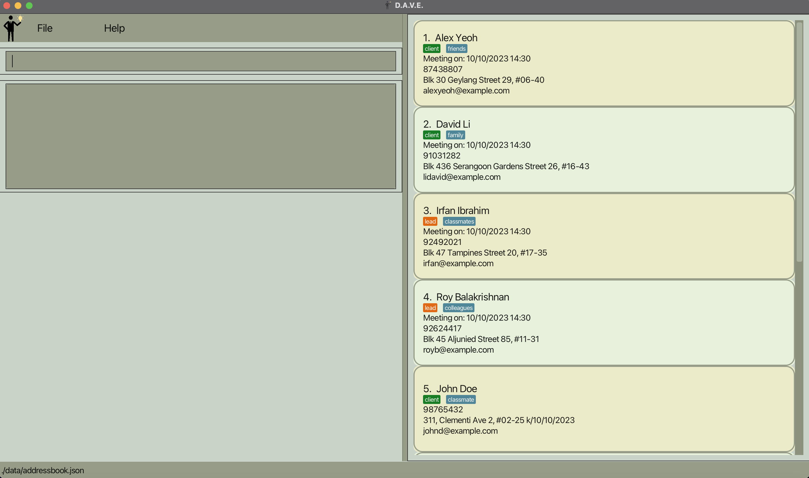
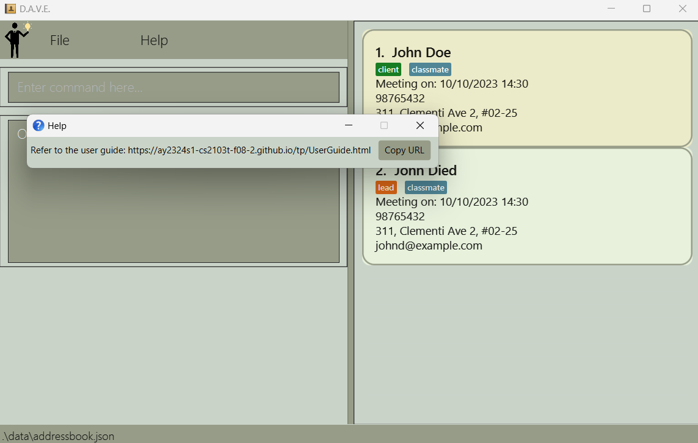
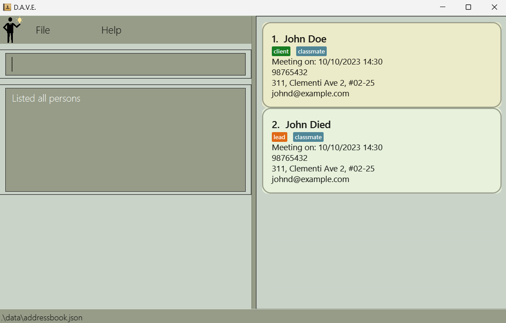
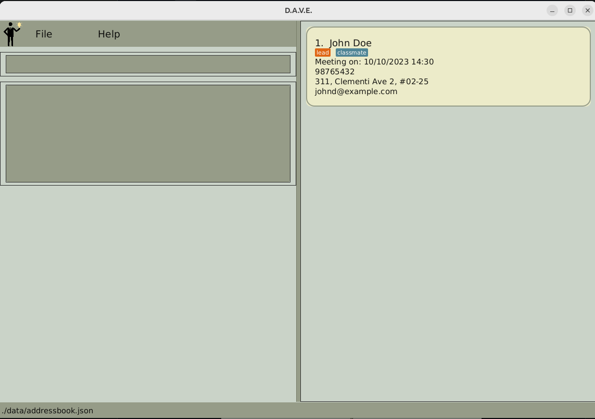
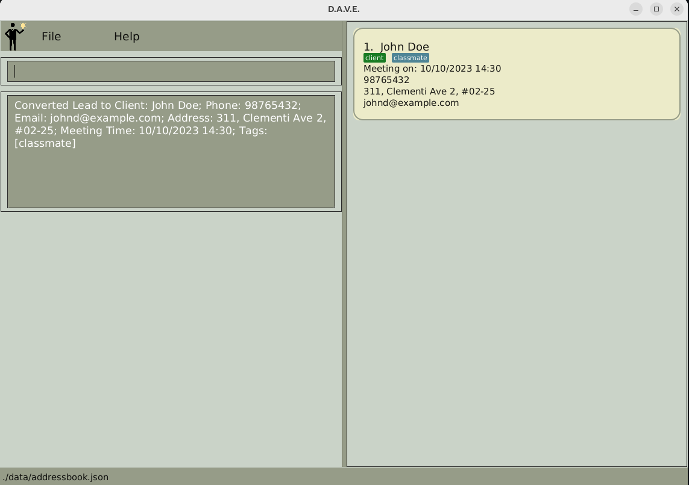
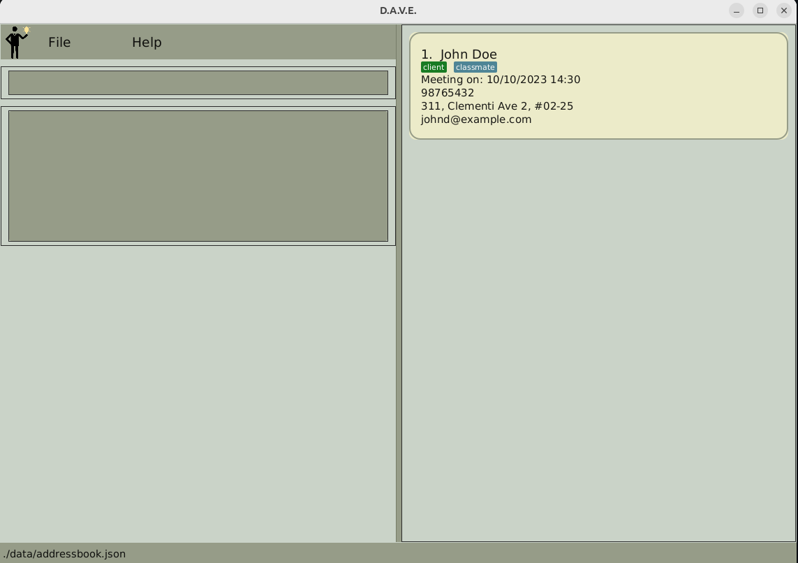
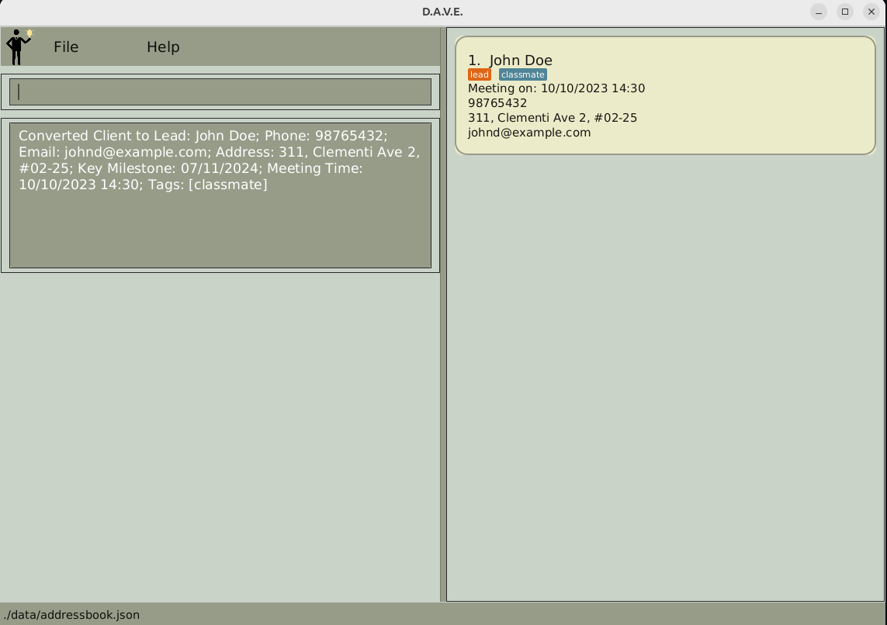
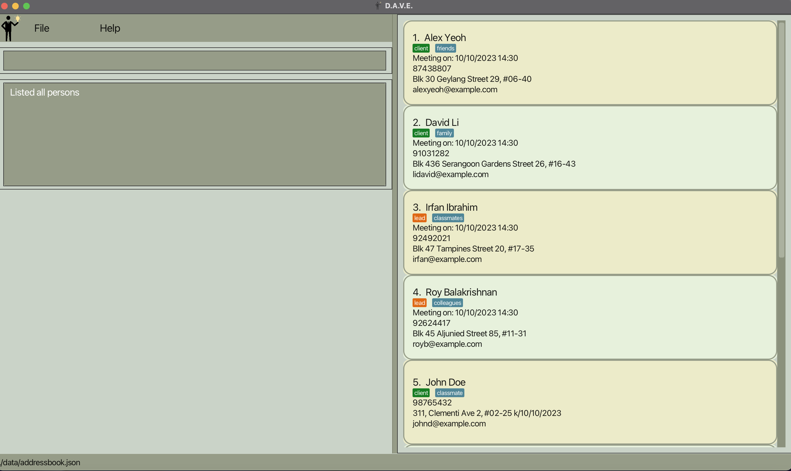
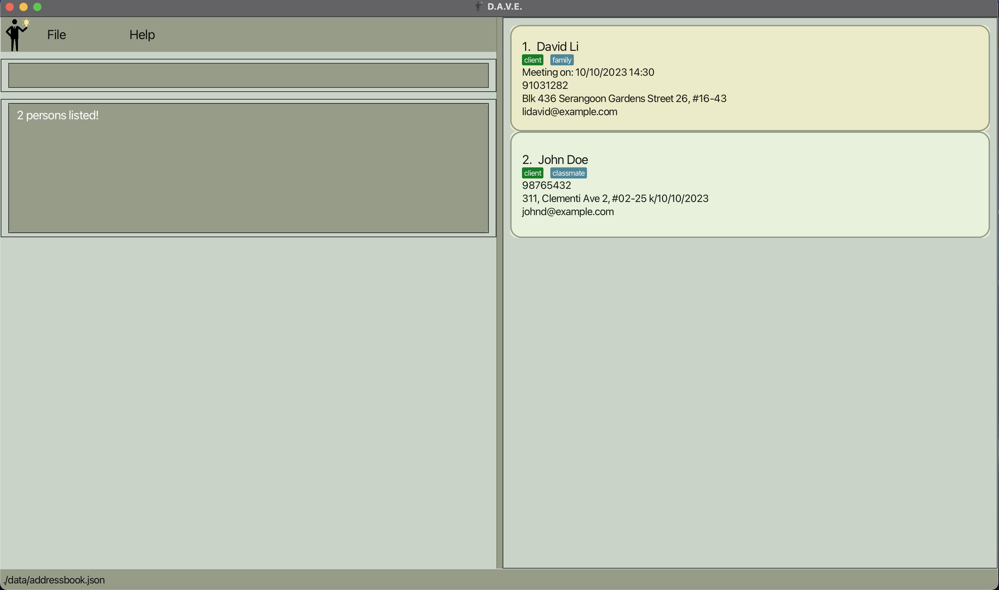

  # Welcome to D.A.V.E. (**D**’financial **A**d**V**isor **E**xpert)

*Manage your leads and clients information effortlessly through D.A.V.E. to gain an edge in your FA journey!*

D.A.V.E. is a leads and clients management tool for student financial advisors specifically in NUS, but can be used for all student financial advisors.

Here’s a quick overview of D.A.V.E.’s features:

- Store and edit information of your leads and clients
- Convert successful leads into clients
- Delete leads and clients
- Keep track of upcoming meetings with leads/clients

D.A.V.E. is here to enhance your advisory journey by simplifying information management, lead conversion, meeting scheduling and more.

# Table of Contents

- [Glossary](#glossary)
- [Quick Start](#quick-start)
- [Features](#features)
  - [Help](#help)
  - [Add lead](#add-lead)
  - [Add client](#add-client)
  - [View all leads and clients](#view-all-leads-and-clients)
  - [View all clients](#view-all-clients)
  - [View all leads](#view-all-leads)
  - [View specific person](#view-specific-person)
  - [Delete lead/client](#delete)
  - [Edit lead/client](#edit)
  - [Add meeting time](#add-meeting-time)
  - [Delete meeting time](#delete-meeting-time)
  - [Sort meeting time](#sort-meeting-time)
  - [Convert lead to client](#convert-lead-to-client)
  - [Convert client to lead](#convert-client-to-lead)
  - [Locating persons by name](#locating-persons-by-name)
  - [Clear address book](#clear-address-book)
  - [Exit the program](#exit-the-program)
- [FAQ](#faq)
- [Known issues](#known-issues)
- [Command Summary](#command-summary)

# Glossary

Here are some descriptions of the words we use throughout the User Guide:

| Term    | Definition                                                                                            |
|---------|-------------------------------------------------------------------------------------------------------|
| Command | An input from the user that tells D.A.V.E. to perform an action (e.g. add a client).                  |
| GUI     | Graphical User Interface (GUI) refers to the visual display of D.A.V.E that users can see.            |
| CLI     | Command Line Interface (CLI) represents a text-based user interface to interact with the application. |
| Person  | A client or a lead.                                                                                   |

# Quick Start

1. Ensure you have Java `11` or above installed in your computer.
2. Download the latest release of `DAVE.jar` from [here](https://github.com/AY2324S1-CS2103T-F08-2/tp/releases).
3. Copy the file to the folder you want to use as the *home folder* for D.A.V.E.
4. Open a command terminal, `cd` into the folder you put the jar file in, and use the `java -jar DAVE.jar` command to run the application.
   A GUI similar to the below should appear in a few seconds. Note how the app contains some sample data.

<div align="center">
    
    <p>After starting up the application</p>
</div>

# Features

<div markdown="block" class="alert alert-info">

**:information_source: Notes about the command format:**<br>

* Words in `UPPER_CASE` are the parameters to be supplied by the user.<br>
  e.g. in `add n/NAME`, `NAME` is a parameter which can be used as `add n/John Doe`.

* Items in square brackets are optional.<br>
  e.g `n/NAME [t/TAG]` can be used as `n/John Doe t/friend` or as `n/John Doe`.

* Items with `…`​ after them can be used multiple times including zero times.<br>
  e.g. `[t/TAG]…​` can be used as ` ` (i.e. 0 times), `t/friend`, `t/friend t/family` etc.

* Parameters can be in any order.<br>
  e.g. if the command specifies `n/NAME p/PHONE_NUMBER`, `p/PHONE_NUMBER n/NAME` is also acceptable.

* Extraneous parameters for commands that do not take in parameters (such as `help`, `list`, `exit` and `clear`) will be ignored.<br>
  e.g. if the command specifies `help 123`, it will be interpreted as `help`.

* If you are using a PDF version of this document, be careful when copying and pasting commands that span multiple lines as space characters surrounding line-breaks may be omitted when copied over to the application.
</div>

### Help

- What it does: Displays a pop-up that contains to the User Guide for the user's reference.
- Command: `help`.
- Precise expected output when the command succeeds:
```
Opened help window.
```

<div align="center">
    
    <p>After using help command</p>
</div>

### Add lead

- What it does: Adds a lead and their basic information, e.g. name, phone number, email, address, key milestone etc. The key milestone is a date that represents a lead's life-changing event, e.g. ORD, marriage, graduation etc.

<box type="important">
    Duplicate names are not allowed in the record. The system will prevent the entry of the same name for more than once. 
</box>

- Command format: `addlead n/NAME p/PHONE e/EMAIL a/ADDRESS k/KEY_MILESTONE [m/MEETING_TIME] [t/TAG]...`.
- Example usage: `Example: addlead n/John Doe p/98765432 e/johnd@example.com a/311, Clementi Ave 2, #02-25 k/01/12/2023 m/10/10/2023 14:30 t/classmate`.

<div align="center">
    
    <p>Before using addlead command</p>
</div>

<div align="center">
    
    <p>After using addlead command</p>
</div>

- Acceptable values for each compulsory parameter:
    - `NAME`: can contain any string of alphanumeric characters.
      - The name can contain spaces but cannot be blank (only contain spaces).
      - Names are case-sensitive. This means that "John" and "john" are treated as different names, and you can enter both in the record without any issues. 
    - `PHONE`: any valid string of integers, between 3 digits and 8 digits long.
    - `EMAIL`: a string of the format `local-part@domain`.
      - The local-part should only contain alphanumeric characters and these special characters, excluding the parentheses, (+_.-). 
      - The local-part may not start or end with any special characters. 
      - The domain name is made up of domain labels separated by periods.
      - The domain name must end with a domain label at least 2 characters long.
      - Each domain label must start and end with alphanumeric characters and only separated by hyphens, if any.
    - `ADDRESS`: can contain any alphanumeric character, must not be blank.
    - `KEY_MILESTONE`: only contains date in the format of `dd/MM/yyyy`
      - ``KEY_MILESTONE`` is the date of a lead's life-changing event.
      - The date must be a valid date, these are invalid: `31/02/2020`, `25/13/2021`
- Acceptable values for each optional parameter:
    - `MEETING_TIME`: A string of format `dd/MM/yyyy HH:mm`, must not be blank if any meeting time is declared.
      - The date must be a valid date, these are invalid: `31/02/2020`, `25/13/2021`
      - The time must be a valid time in the 24-hour format, these are invalid: `25:00`, `12:60`
      - Meeting time can be before the current date and time.
    - `TAG`: can contain any alphanumeric character, must not be blank if any tag is declared.
- Precise expected outputs when the command succeeds:
```
New lead added: <lead details>
```

- Precise expected outputs when the command fails:

When adding a lead with an invalid command format:
```
Invalid command format! 
addlead: Adds a lead to the address book. Parameters: n/NAME p/PHONE e/EMAIL a/ADDRESS k/KEY_MILESTONE [m/MEETING_TIME] [t/TAG]...
Example: addlead n/John Doe p/98765432 e/johnd@example.com a/311, Clementi Ave 2, #02-25 k/01/12/2023 m/10/10/2023 14:30 t/classmate
```

When adding a lead with the same name as an existing lead:
```
This lead already exists in the address book
```

### Add Client
- What it does: Adds a client and their basic information, e.g. name, phone number, email, address, etc.

<box type="important">
    Duplicate names are not allowed in the record. The system will prevent the entry of the same name for more than once. 
</box>

- Command format: `addclient n/NAME p/PHONE e/EMAIL a/ADDRESS [m/MEETING_TIME] [t/TAG]...`.
- Example usage: `Example: addclient n/John Doe p/98765432 e/johnd@example.com a/311, Clementi Ave 2, #02-25 m/10/10/2023 14:30 t/classmate`.

<div align="center">
    
    <p>Before using addclient command</p>
</div>

<div align="center">
    
    <p>After using addclient command</p>
</div>

- Acceptable values for each compulsory parameter:
  - `NAME`: can contain any string of alphanumeric characters.
    - The name can contain spaces but cannot be blank (only contain spaces).
    - Names are case-sensitive. This means that "John" and "john" are treated as different names, and you can enter both in the record without any issues. 
  - `PHONE`: any valid string of integers, between 3 digits and 8 digits long.
  - `EMAIL`: a string of the format `local-part@domain`.
    - The local-part should only contain alphanumeric characters and these special characters, excluding the parentheses, (+_.-).
    - The local-part may not start or end with any special characters.
    - The domain name is made up of domain labels separated by periods.
    - The domain name must end with a domain label at least 2 characters long.
    - Each domain label must start and end with alphanumeric characters and only separated by hyphens, if any.
  - `ADDRESS`: can contain any alphanumeric character, must not be blank.
- Acceptable values for each optional parameter:
  - `MEETING_TIME`: A string of format `dd/MM/yyyy HH:mm`, must not be blank if any meeting time is declared.
    - The date must be a valid date, these are invalid: `31/02/2020`, `25/13/2021`.
    - The time must be a valid time in the 24-hour format, these are invalid: `25:00`, `12:60`.
    - Meeting time can be before the current date and time.
  - `TAG`: can contain any alphanumeric character, must not be blank if any tag is declared.

- Precise expected outputs when the command succeeds:
```
New client added: <client details>
```

- Precise expected outputs when the command fails:

When adding a client with an invalid command format:
```
Invalid command format!
addclient: Adds a client to the address book. Parameters: n/NAME p/PHONE e/EMAIL a/ADDRESS [m/MEETING_TIME] [t/TAG]...
Example: addclient n/John Doe p/98765432 e/johnd@example.com a/311, Clementi Ave 2, #02-25 m/10/10/2023 14:30 t/classmate
```

When adding a client with the same name as an existing client:
```
This client already exists in the address book
```

### View all leads and clients

- What it does: Lists all leads and clients in the address book to the user. The information displayed includes the Lead/Client's name, phone number, email, address, meeting time and tags.
- Command: `list`.
- Precise expected output when the command succeeds:
```
Listed all persons
```

<div align="center">
    
    <p>After using list command</p>
</div>

### View all clients

- What it does: View all clients you have stored, including their basic information and index in the list of clients, e.g. id, name, age, gender, occupation, etc.
- Command: `listclient`.
- Precise expected outputs when the command succeeds:

<div align="center">
    
    <p>List of leads and clients</p>
    
    <p>After using listclient command</p>
</div>

- Precise expected outputs when there are clients stored:
```
Listed all clients
```
- Precise expected outputs when there are no clients stored:
```
There are no clients in the address book
```

### View all leads

- What it does: View all leads you have stored, including their basic information and index in the list of leads, e.g. id, name, age, gender, occupation, etc.
- Command: `listlead`.
- Precise expected outputs when the command succeeds:

<div align="center">
    
    <p>List of leads and clients</p>
    
    <p>After using listlead command</p>
</div>

- Precise expected outputs when there are leads stored:
```
Listed all leads
```
- Precise expected outputs when there are no leads stored:
```
There are no leads in the address book
```

### View Specific Person

- What it does: View a specific person that you have stored, including their basic information and another relevant lead/client
  details that are not displayed in the main address list.
- Command: `view INDEX`.
- Example usage: `view 1`.

<div align="center">
    
    <p>After using View Command on a Lead</p>
</div>

<div align="center">
    
    <p>After using View Command on a Client</p>
</div>

- Acceptable values for `INDEX` parameter:
  - Must be an integer from `1` to the last index of the filtered list shown in the address book.
- Precise expected output when the command succeeds:
```
Viewed Person Successfully
```

- Precise expected output when command fails:

When viewing a person without specifying an index:
```
Invalid command format! 
view: Views the person identified by the index number used.
Parameters: INDEX (must be a positive integer)
Example: view 1
```

When viewing a person with an invalid index:
```
The person index provided is invalid
```


### Delete

- What it does: Deletes a lead/client from the list of leads and/or clients shown.
- Command format: `delete INDEX`.
- Example usage: `delete 1`.

<div align="center">
    
    <p>Before delete</p>
</div>

<div align="center">
    
    <p>After delete</p>
</div>

- Acceptable values for `INDEX` parameter:
    - Must be an integer from `1` to the last index of the filtered list shown in the address book.
- Precise expected outputs when the command succeeds:

```
Deleted person: <person details>
```

- Precise expected outputs when the command fails:

When deleting a person without specifying an index:
```
Invalid command format! 
delete: Deletes the person identified by the index number used in the displayed person list.
Parameters: INDEX (must be a positive integer)
Example: delete 1
```

When deleting a person with an invalid index:
```
The person index provided is invalid
```

### Edit

- What it does: Edit the details of a lead or client.

<box type="important">
    Duplicate names are not allowed in the record. The system will prevent the entry of the same name for more than once. 
</box>

- Command format: `edit INDEX [n/NAME] [p/PHONE] [e/EMAIL] [a/ADDRESS] [k/KEY_MILESTONE] [t/TAG]...`.
- Example usage: `edit 1 p/91234567 e/johndoe@example.com`.

<div align="center">
    
    <p>Before using edit</p>
</div>

<div align="center">
    
    <p>After using edit</p>
</div>

- Acceptable values for each compulsory parameter:
  - `INDEX`: Any integer from `1` to the last index of the filtered list shown in the address book.
- Acceptable values for each optional parameter (at least one of the optional parameters must be provided)
  - `NAME`: can contain any string of alphanumeric characters.
    - The name can contain spaces but cannot be blank (only contain spaces).
  - `PHONE`: any valid string of integers, between 3 digits and 8 digits long.
  - `EMAIL`: a string of the format `local-part@domain`.
    - The local-part should only contain alphanumeric characters and these special characters, excluding the parentheses, (+_.-).
    - The local-part may not start or end with any special characters.
    - The domain name is made up of domain labels separated by periods.
    - The domain name must end with a domain label at least 2 characters long.
    - Each domain label must start and end with alphanumeric characters and only separated by hyphens, if any.
  - `ADDRESS`: can contain any alphanumeric character, must not be blank.
  - `KEY_MILESTONE`**(Only for leads)**: only contains date in the format of `dd/MM/yyyy`.
    - The date must be a valid date, these are invalid: `31/02/2020`, `25/13/2021`.
    - If the edited person is a client, no ``KEY_MILESTONE`` of the person will be edited as client does not have ``KEY_MILESTONE``
  - `MEETING_TIME`: only contains date in the format of `dd/MM/yyyy HH:mm`.
    - The date must be a valid date, these are invalid: `31/02/2020`, `25/13/2021`.
    - The time must be a valid time in the 24-hour format, these are invalid: `25:00`, `12:60`.
    - If the edited `MEETING_TIME` is `null`, it will not remove the existing person's `MEETING_TIME`.

<box type="tip">
Lead/Client's meeting time can be added using edit command. However, it is more convenient to use the <code>addmeeting</code> command.
</box>

- `TAG`: can contain any alphanumeric character, must not be blank if any tag is declared.

<box type="tip">
    <code>edit INDEX t\</code> will clear the tags of a lead or client.
</box>

<box type="tip">
    You can add more tags to a person using the <code>edit</code> command. For example, if person 1 already has the tag <code>classmate</code>
    and you want to add the <code>friend</code> tag, you can enter the command <code>edit 1 t/classmate t/friend</code>.
</box>

- Precise expected outputs when the command succeeds:
```
Edited Person: <Person details>
```

- Precise expected outputs when the command fails:

When editing a person with an invalid command format:
```
Invalid command format! 
edit: Edits the details of the person identified by the index number used in the displayed person list. Existing values will be overwritten by the input values.
Parameters: INDEX (must be a positive integer) [n/NAME] [p/PHONE] [e/EMAIL] [a/ADDRESS] [k/KEY_MILESTONE] [m/MEETING_TIME] [t/TAG]...
Example: edit 1 p/91234567 e/johndoe@example.com
```

When editing a person without specifying any field e.g. `edit 1`:
```
At least one field to edit must be provided.
```

When editing a person with an invalid index:
```
The person index provided is invalid
```

### Add meeting time

- What it does: Adds a meeting time to a person.
- Command format: `addmeeting INDEX m/MEETING_TIME`.
- Example usage: `addmeeting 1 m/12/10/2023 16:00`.

<div align="center">
    
    <p>Before using addmeeting</p>
</div>

<div align="center">
    
    <p>After using addmeeting</p>
</div>

- Acceptable values for each compulsory parameter:
    - `INDEX`: Any integer from `1` to the last index of the displayed list.
    - `MEETING_TIME`: A string of format `dd/MM/yyyy HH:mm`.
      - The date must be a valid date, these are invalid: `31/02/2020`, `25/13/2021`.
      - The time must be a valid time in the 24-hour format, these are invalid: `25:00`, `12:60`.
      - Meeting time can be before the current date and time.
- Precise expected outputs when the command succeeds:

```
Added Meeting: <MEETING_TIME> to Person <INDEX>
```

- Precise expected outputs when the command fails:

When adding a meeting time to an invalid index or with an invalid datetime format:  
```
Invalid command format!
addmeeting: Adds a new meeting time to the person identified by the displayed index in the address book.
Parameters: INDEX (must be a positive integer) m/MEETING_TIME
Example: addmeeting 1 m/12/10/2023 16:00
```

When adding a meeting time to a person who already has an existing meeting:

```
Person already has a meeting time, use the edit command instead
```

### Delete meeting time

- What it does: Delete a meeting time for meetings that has been cancelled or postponed.
<box type="tip">
If the person has no meeting time, delete meeting will leave the person's meeting time as null.
</box>

- Command format: `deletemeeting INDEX`.
- Example usage: `deletemeeting 1`.

<div align="center">
    
    <p>Before using deletemeeting</p>
</div>

<div align="center">
    
    <p>After using deletemeeting</p>
</div>

- Acceptable values for `INDEX` parameter:
    - Any integer from `1` to the last index of the filtered list shown in the address book.
- Precise expected outputs when the command succeeds:
```
Deleted Meeting: <MEETING_TIME> from Person <INDEX>
```
- Precise expected outputs when the command fails:
```
Invalid command format! 
deletemeeting: Deletes the meeting identified by the index number used in the displayed meeting list.
Parameters: INDEX (must be a positive integer)
Example: deletemeeting 1
```

### Sort meeting time

- What it does: Sorts the meeting times of all leads and clients chronologically, displaying
  only entries with a meeting time.
- Command format: `sortmeeting`.
- Example usage:

<div align="center">
    
    <p>Before using sortmeeting</p>
</div>

<div align="center">
    
    <p>After using sortmeeting</p>
</div>

- Precise expected outputs when the command succeeds:

`Sorted all meeting times chronologically`

### Convert lead to client

- What it does: Converts a lead to client.
- Command format: `converttoclient INDEX`.
- Example usage: `converttoclient 1`.
- Acceptable values for `INDEX` parameter:
  - Any integer from `1` to the last index of the filtered list shown in the address book, person must be a lead.
- Example usage

<div align="center">
    
    <p>Before using converttoclient</p>
</div>

<div align="center">
    
    <p>After using converttoclient</p>
</div>

- Precise expected outputs when the command succeeds:

`Converted lead to client`

- Precise expected outputs when the command fails:

`The person index provided is invalid`


### Convert client to lead

- What it does: Converts a client into lead. The ``KEY_MILESTONE`` is 1 year
from current date to ensure a follow-up by the user.
- Command format: `converttolead INDEX`.
- Example usage: `converttolead 1`.
- Acceptable values for `INDEX` parameter:
  - Any integer from `1` to the last index of the filtered list shown in the address book, person must be a client.
- Example usage

<div align="center">
    
    <p>Before using converttolead</p>
</div>

<div align="center">
    
    <p>After using converttolead</p>
</div>

- Precise expected outputs when the command succeeds:
`Converted client to lead`

- Precise expected outputs when the command fails:

`The person index provided is invalid`


### Locating persons by name
- What it does: Finds persons whose names contain any of the given keywords as names.
- Command format: `find NAME [MORE_NAMES]`.
- Example usage: `find John David`.
- Acceptable values for parameter: 
  - `NAME`: Any name from the list.
- Precise expected output when the command succeeds:
```
<NUMBER> persons listed!
```

- Precise expected output when the command fails:

```
Invalid command format!
find: Finds all persons whose names contain any of the specified names (case-insensitive) and displays them as a list with index numbers.
Parameters: NAME [MORE_NAMES]...
Example: find alice bob charlie
```

<box type="info">
  <ul>
    <li>The search is case-insensitive. e.g. <code>John</code> will match <code>john</code>.</li>
    <li>Only full words will be matched. e.g. <code>John</code> will not match <code>Johns</code>.</li>
    <li>Persons matching at least one keyword will be returned (i.e. OR search). e.g. <code>find john david</code> will return <code>John Doe</code>, <code>David Li</code>.</li>
  </ul>
</box>

Example usage:

<div align="center">
    
    <p>Before using find</p>
</div>

<div align="center">
    
    <p>After using find john david</p>
</div>

### Clear address book
- What it does: Clears all entries from the address book.
- Command format: `clear`.
- Precise expected output when the command succeeds:

```
Address book has been cleared!
```

<box type="warning" theme="danger">
    This command will delete all the data from the address book. This command cannot be reversed. Proceed with caution.
</box>

### Exit the program
- What it does: Exits the program. 
- Command format: `exit`.

--------------------------------------------------------------------------
## FAQ

**Q**: How do I transfer my data to another computer?<br>
**A**: Install the app in the other computer and overwrite the empty data file it creates with the file that contains the data of your previous JobFestGo home folder.

**Q**: What do I do if the clicking of the Dave JAR file does not work?<br>
**A**: Given below are the steps to launch Dave using CLI:

1. Open the command prompt
1. Navigate to the directory where the JAR file is located using cd [JAR file location]
1. Type `java -jar DAVE.jar` and press enter
1. Dave should launch

**Q**: How can I check my Java version?<br>
**A**: Open a command prompt and type `java -version` . If you do not have Java installed, you
can download it [here](https://www.oracle.com/java/technologies/downloads/#java11).

---------------------------------------------------------------------------------

## Known issues

1. **When using multiple screens**, if you move the application to a secondary screen, and later switch to using only the primary screen, the GUI will open off-screen. The remedy is to delete the `preferences.json` file created by the application before running the application again.

----------------------------------------------------------------------------------
## Command summary


| Action                         | Format, Examples                                                                                                                                                                                                                |
|--------------------------------|---------------------------------------------------------------------------------------------------------------------------------------------------------------------------------------------------------------------------------|
| **Help**                       | `help`                                                                                                                                                                                                                          |
| **Add lead**                   | `addlead n/NAME p/PHONE e/EMAIL a/ADDRESS k/KEY_MILESTONE [m/MEETING_TIME] [t/TAG]...​` <br> e.g. `addlead n/John Doe p/98765432 e/johnd@example.com a/311, Clementi Ave 2, #02-25 k/01/12/2023 m/10/10/2023 14:30 t/classmate` |
| **Add client**                 | `addclient n/NAME p/PHONE e/EMAIL a/ADDRESS [m/MEETING_TIME] [t/TAG]...​` <br> e.g. `addclient n/John Doe p/98765432 e/johnd@example.com a/311, Clementi Ave 2, #02-25 m/10/10/2023 14:30 t/classmate`                          |
| **View all leads and clients** | `list`                                                                                                                                                                                                                          |
| **View all clients**           | `listclient`                                                                                                                                                                                                                    |
| **View all leads**             | `listlead`                                                                                                                                                                                                                      |
| **View a specific person**     | `view INDEX`<br> e.g. `view 1`                                                                                                                                                                                                  |
| **Delete lead/client**         | `delete INDEX` <br> e.g. `delete 1`                                                                                                                                                                                             |
| **Edit lead/client**           | `edit INDEX [n/NAME] [p/PHONE] [e/EMAIL] [a/ADDRESS] [k/KEY_MILESTONE] [t/TAG]...​`<br> e.g. `edit 1 n/John Doe p/98765432`                                                                                                     |
| **Add meeting time**           | `addmeeting INDEX m/MEETING_TIME` <br> e.g. `addmeeting 1 m/12/10/2023 16:00`                                                                                                                                                   |
| **Delete meeting time**        | `deletemeeting INDEX` <br> e.g. `deletemeeting 1`                                                                                                                                                                               |
| **Sort meeting time**          | `sortmeeting`                                                                                                                                                                                                                   |
| **Convert lead to client**     | `converttoclient INDEX` <br> e.g. `converttoclient 1`                                                                                                                                                                            |
| **Convert client to lead**     | `converttolead INDEX` <br> e.g. `converttolead 1`                                                                                                                                                                                |
| **Locating person by name**    | `find NAME [MORE_NAMES]` <br> e.g. `find John David`                                                                                                                                                                            |
| **Clear address book**         | `clear`                                                                                                                                                                                                                         |
| **Exit the program**           | `exit`                                                                                                                                                                                                                          |
