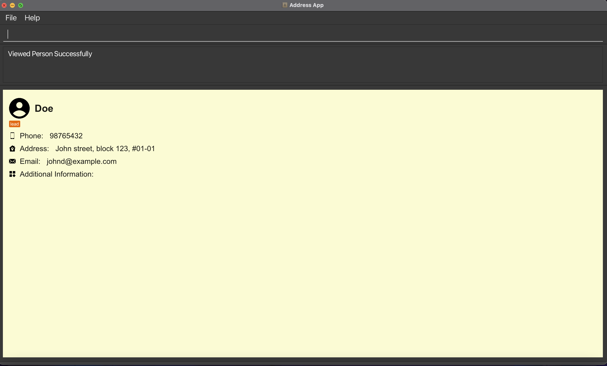

  # Welcome to D.A.V.E. (**D**’financial **A**d**V**isor **E**xpert)

*Manage your leads and clients information effortlessly through D.A.V.E. to gain an edge in your FA journey!*

D.A.V.E. is a leads and clients management tool for student financial advisors specifically in NUS, but can be used for all student financial advisors.

Here’s a quick overview of D.A.V.E.’s features

- Store and edit information of your leads and clients
- Convert successful leads into clients
- Manage clients’ policies
- Delete policies and leads
- Reminders such as upcoming meetings with leads/clients

# Table of Contents

- [Glossary](#Glossary)
- [Tutorial for new users](#D.A.V.E.-Tutorial-for-new-users)
- [Features](#Features)

# Glossary

## Definitions

Here are some descriptions of the words we use throughout the User Guide:

| Term | Definition |
| --- | --- |
| Command | An input from the user that tells D.A.V.E. to perform an action (e.g. add a client). |
| GUI | Graphical User Interface (GUI) refers to the visual display of D.A.V.E that users can see. |
| CLI | Command Line Interface (CLI) represents a text-based user interface to interact with the application. |

# D.A.V.E. Tutorial for new users

1. Ensure you have Java `11` or above installed in your computer.
2. Download the latest `DAVE.jar` from here.
3. Copy the file to the folder you want to use as the *home folder* for D.A.V.E.
4. Double-click `DAVE.jar` to start the app.

# Features


### Add lead

- What it does: Add potential leads and their basic information, e.g. name, age, year of study, major, etc.
- Command format: `addlead n/NAME p/PHONE e/EMAIL a/ADDRESS [t/TAG]...`.
- Example usage: `Example: addlead n/John Doe p/98765432 e/johnd@example.com a/311, Clementi Ave 2, #02-25 t/classmate`.
- Acceptable values for each parameter:
    - `NAME`: can contain any character.
    - `PHONE`: any valid 8-digit integer.
    - `EMAIL`: a string of the format `local-part@domain`
    - `ADDRESS`: can contain any character.
    - `TAG`: can contain any character.
- Precise expected outputs when the command succeeds:

<div align="center">
    
    <p>After using addlead command</p>
</div>

- Precise expected outputs when the command fails:

```
Invalid command format!
addlead: Adds a lead to the address book. Parameters: n/NAME p/PHONE e/EMAIL a/ADDRESS [t/TAG]...
Example: addlead n/John Doe p/98765432 e/johnd@example.com a/311, Clementi Ave 2, #02-25 t/classmate
```

### Add Lead with Key Milestone Information [Coming soon]
- What it does: Add potential leads and their basic information, e.g. name, age, year of study, major, etc.
- Command format: `addlead n/NAME p/PHONE e/EMAIL a/ADDRESS k/DATE [t/TAG]...`.
- Example usage: `Example: addlead n/John Doe p/98765432 e/johnd@example.com a/311, Clementi Ave 2, #02-25 k/2022-12-01 t/classmate`.
- Acceptable values for each parameter:
    - `NAME`: can contain any character.
    - `PHONE`: any valid 8-digit integer.
    - `EMAIL`: a string of the format `local-part@domain`
    - `ADDRESS`: can contain any character.
    - `DATE`: only contains date in the format of ``YYYY-MM-DD``
    - `TAG`: can contain any character.

### Add Client
- What it does: Add potential clients and their basic information, e.g. name, age, year of study, major, etc.
- Command format: `addclient n/NAME p/PHONE e/EMAIL a/ADDRESS [t/TAG]...`.
- Example usage: `Example: addclient n/John Doe p/98765432 e/johnd@example.com a/311, Clementi Ave 2, #02-25 t/classmate`.
- Acceptable values for each parameter:
  - `NAME`: can contain any character.
  - `PHONE`: any valid 8-digit integer.
  - `EMAIL`: a string of the format `local-part@domain`
  - `ADDRESS`: can contain any character.
  - `TAG`: can contain any character.
- Precise expected outputs when the command succeeds:

<div align="center">
    
    <p>After using addclient command</p>
</div>

- Precise expected outputs when the command fails:

```
Invalid command format!
addclient: Adds a client to the address book. Parameters: n/NAME p/PHONE e/EMAIL a/ADDRESS [t/TAG]...
Example: addclient n/John Doe p/98765432 e/johnd@example.com a/311, Clementi Ave 2, #02-25 t/classmate
```

### View all clients

- What it does: View all clients you have stored, including their basic information and index in the list of clients, e.g. id, name, age, gender, occupation, etc.
- Command: `listclient`.
- Precise expected outputs when the command succeeds:

In output section of the
`List of all clients`

<h4>Examples of usage:</h4>

<div align="center">
    
    <p>List of leads and clients</p>
    
    <p>After using listclient command</p>
</div>

### View all leads

- What it does: View all leads you have stored, including their basic information and index in the list of leads, e.g. id, name, age, gender, occupation, etc.
- Command: `listlead`.
- Precise expected outputs when the command succeeds:

`List of all leads`

<h4>Example usage:<h4>

<div align="center">
    
    <p>List of leads and clients</p>
    
    <p>After using listlead command</p>
</div>

### View Specific Person

- What it does: View a specific person that you have stored, including their basic information and another relevant lead/client
  details.
- Command: `view INDEX`.
- Example usage: `view 1`.
- Acceptable values for `INDEX` parameter:
  - Must be an integer from `1` to the last index of the main list.
- Precise expected output when the command succeeds:

`Viewed Person Successfully`

- Precise expected output when command fails:

`The person index provided is invalid`

<h4>Example usage:<h4>

<div align="center">
    
    <p>After using View Command on a Lead</p>
</div>

<div align="center">
    
    <p>After using View Command on a Client</p>
</div>

### Delete

- What it does: Deletes a lead from your list of leads.
- Command format: `delete INDEX`.
- Example usage: `delete 1`.
- Acceptable values for `INDEX` parameter:
    - Must be an integer from `1` to the last index of the leads list
- Precise expected outputs when the command succeeds:

`Lead deleted: <lead details>`

- Precise expected outputs when the command fails:

```
Invalid command format!
delete: Deletes the person identified by the index number used in the displayed person list.
Parameters: INDEX (must be a positive integer)
```

### Add meeting time

- What it does: Adds a meeting time for a lead
- Command format: `addmeetingtime INDEX m/MEETING_TIME`
- Example usage: `addmeetingtime 1 m/12/12/2020 12:00`
- Acceptable values for each parameter:
    - `INDEX`: Any integer from `1` to the last index of the leads list.
    - `MEETING_TIME`: A string of format `dd/MM/yyyy HH:mm`.
- Precise expected outputs when the command succeeds:

`Meeting time added to <lead/client> : <meeting datetime>`

- Precise expected outputs when the command fails:

`Meeting time failed to add. Please enter a valid lead id or meeting time`

### Delete meeting time for lead

- What it does: Delete a meeting time for meetings that has been cancelled or postponed.
- Command format: `deletemeeting --lead <lead_id> --id <meeting_time_id>`
- Example usage: `deletemeeting --lead 1 --id 1`
- Acceptable values for each parameter:
    - `lead`: Any integer from `1` to the last index of the leads list
    - `id`: Any integer from `1` to the last index of the list
- Precise expected outputs when the command succeeds:

`Meeting time deleted from <lead> : <meeting datetime>`

- Precise expected outputs when the command fails:

`Meeting time failed to be deleted. Please enter a valid lead id or meeting time`

### Convert lead to client

- What it does: Converts a lead to client.
- Command format: `convertoclient INDEX`
- Example usage: `converttoclient 1`
- Acceptable values for each parameter:
  - `INDEX`: Any integer from `1` to the last index of the leads list
- Precise expected outputs when the command succeeds:

`Converted lead to client`

- Precise expected outputs when the command fails:

`The person index provided is invalid`

### Convert client to lead

- What it does: Converts a client into lead, the key milestone is 1 year
from current date to ensure a followup by the user
- Command format: `convertolead INDEX`
- Example usage: `converttolead 1`
- Acceptable values for each parameter:
  - `INDEX`: Any integer from `1` to the last index of the leads list
- Precise expected outputs when the command succeeds:

`Converted client to lead`

- Precise expected outputs when the command fails:

`The person index provided is invalid`
